<!-- Generado por ux-product-experience-review v1.4.0 · SURFACE_MODE=LANDING_PAGE (OVERRIDE) · PLATFORM_MODE=WEB (OVERRIDE) -->

# Anclora Group Landing — Auditoría UX/UI y de conversión

**Fecha:** 8 de septiembre de 2026 · **Estado:** PASS_WITH_GAPS
**Repositorio:** anclora-group-landing · **Rama:** development · **HEAD:** 0f6300ee (sincronizado con origin/development)
**URL canónica declarada:** https://anclora.com/ · **Superficie auditada:** build de producción local (127.0.0.1:5288)
**Skill:** ux-product-experience-review 1.4.0 · **SURFACE_MODE:** LANDING_PAGE (OVERRIDE) · **PLATFORM_MODE:** WEB (OVERRIDE) · **DOMAIN_PROFILE:** CORPORATE_TECH_ECOSYSTEM
**Evidencias de navegador:** 17 · **Findings:** 19 (1 CRITICAL · 4 HIGH · 10 MEDIUM · 4 LOW)
**Informe HTML:** `anclora-group-landing-ux-audit-2026-09-08.html`

> Auditoría de solo lectura. No se modificó el producto, la configuración, el despliegue ni el dominio.

---

## 01 · Resumen ejecutivo

La landing está bien escrita, bien compuesta y visualmente por encima de la media de su categoría. El problema no es el diseño: es que **la puerta de entrada no lleva a ninguna parte**. El dominio canónico no sirve este sitio, y los siete CTAs de producto devuelven al visitante a la misma sección de contacto.

> **Hallazgo dominante**

El dominio declarado como canónico en `index.html`, `sitemap.xml`, `og:url` y el bloque JSON-LD — https://anclora.com/ — resuelve hoy a infraestructura de Shopify (23.227.38.65), presenta un certificado *.myshopify.com caducado el 15/11/2025 y responde HTTP 409 / 403. Ninguna persona que siga un enlace compartido, un resultado de búsqueda o una tarjeta Open Graph de Anclora Group llega hoy a esta landing.

### Las once oportunidades mayores

| Dimensión | Oportunidad observada | Ref. |
|---|---|---|
| **Mayor fricción de usuario** | Seis botones «Ver producto» llevan a `#contact`, saltando 4.400 px hacia adelante sin explicación. El visitante pide ver un producto y recibe un formulario de contacto que no existe. | F-02 |
| **Mayor claridad de mensaje** | El `<h1>` es «Anclora Group» — el nombre, no la promesa. La propuesta de valor real vive en el subtítulo, un nivel por debajo de donde el lector la busca. | F-14 |
| **Mayor oportunidad de conversión** | La única conversión existente es un `mailto:`. No hay formulario, ni canal alternativo, ni expectativa de respuesta; en la sección de contacto el correo ni siquiera es un enlace. | F-17 |
| **Mayor carga cognitiva** | Once nombres de producto nuevos, todos con el mismo estado («ecosistema interno»), el mismo peso visual y el mismo CTA. Nada indica por dónde empezar. | F-12 |
| **Mayor quick win** | Sustituir la etiqueta «Ver producto» por el destino real y, donde no hay destino, cambiar la promesa del botón. Cambio de una línea de copy y una condición ya existente en `ProductCard.tsx`. | §39 |
| **Mayor oportunidad estructural** | Reordenar Evidence: hoy la única «prueba» del primer tercio son tres recuentos del propio contenido de la página. | F-11 |
| **Mayor oportunidad de UI premium** | La sección Productos ocupa 1.896 px con la mitad derecha del ancho vacía en 1440 px. El vacío es amplitud editorial en Founder; aquí es desaprovechamiento. | F-15 |
| **Mayor oportunidad de hero** | El anillo domina; la leyenda que lo descodifica (las cinco líneas) queda tapada por el banner de cookies en la primera visita, en móvil y en tablet. | F-10 |
| **Mayor oportunidad de confianza** | Las cuatro páginas legales son textos en futuro («describirá»). No hay identificación del titular exigida por LSSI-CE. | F-04 |
| **Mayor oportunidad móvil** | 10.594 px de scroll en 390 px de ancho — 12,5 pantallas — de los que Productos consume 3.380 px para siete filas casi idénticas. | F-15 |
| **Mayor oportunidad de memorabilidad** | Hay dos anclas visuales fuertes (el anillo, la curva del Método) y ninguna ancla de mensaje: ninguna frase de la página es repetible de memoria. | §25 |

### Valoración global

**Como pieza de marca, la landing cumple.** La composición es sobria, la tipografía tiene jerarquía real, el movimiento respeta `prefers-reduced-motion`, el banner de cookies es honesto y el relato founder-led es concreto y creíble. Nada aquí parece plantilla ni texto generado.

**Como puerta de entrada operativa, todavía no.** Un visitante que llega comprende quién es Anclora y qué defiende, pero termina el scroll sin poder visitar un solo producto, sin una acción distinta de «escribe un email» y — si viene de un enlace externo — sin haber llegado siquiera. Los tres bloqueos son de destino y de contenido, no de diseño: se resuelven con URLs reales, copy legal real y una segunda acción de conversión, sin tocar el sistema visual.

## 02 · Clasificación de superficie

Esta ejecución existe también para verificar que la skill audita una landing como landing, y no como aplicación.

- **LANDING_PAGE** — surface_mode
- **OVERRIDE** — surface_mode_source
- **HIGH** — surface_mode_confidence
- **WEB** — platform_mode
- **OVERRIDE** — platform_mode_source
- **false** — surface_mode_auto_detected

La autodetección interna (§1B.1 de la skill) coincide con el override: ruta dominante única, sin autenticación, una audiencia principal, narrativa vertical hero → prueba → ecosistema → contacto. Las cuatro rutas legales (`/privacy`, `/terms`, `/legal`, `/cookies`) son páginas de soporte, no un sitio multipágina: no hay navegación entre ellas ni rutas de conversión paralelas, por lo que **no** elevan la clasificación a MARKETING_SITE. No se emite SURFACE_MODE_MISMATCH_WARNING.

### Relevance gating aplicado

Las secciones estructurales de aplicación quedan desactivadas por §1B.5, no por falta de evidencia. **«No aplicable» no es una mala nota**: es la afirmación de que ese criterio no describe esta superficie.

| Bloque de la skill | Estado | Motivo |
|---|---|---|
| APPLICATION_SHELL (§9D) | NOT_APPLICABLE | No hay shell persistente, sidebar ni área de trabajo. El cromo global se audita en §26 como **PUBLIC_SITE_SHELL**. |
| VIEWPORT_ECONOMY (§9C) | NOT_APPLICABLE | No existe workspace cuya densidad medir. El uso de la primera pantalla se evalúa como **FIRST_VIEWPORT** en §09. |
| PRIMARY_WORKSPACE | NOT_APPLICABLE | Sin área operativa dominante. |
| WORKFLOW_EFFICIENCY | NOT_APPLICABLE | Sin tareas repetidas ni flujos CRUD. |
| CONTEXT_MANAGEMENT | NOT_APPLICABLE | Sin estado persistente entre sesiones más allá del acuse de cookies. |
| STRUCTURAL_UX_DETECTION (§9B) | NOT_APPLICABLE | Perfil exclusivo de APPLICATION/DASHBOARD/PORTAL. |
| MODAL_ERGONOMICS | ACTIVE | Excepción justificada: existe un modal real (preferencias de cookies) con foco atrapado y Escape. Se audita en §33. |
| FORM_FRICTION | ACTIVE | Dimensión landing obligatoria. Se evalúa la **ausencia** de formulario como decisión de conversión (§20), no como campo faltante. |
| LANDING_PAGE_PROFILE (§9F) | ACTIVE | Perfil rector: audiencia, oferta, hero, CTA, prueba, secuencia, memorabilidad, anti-template, dark patterns. |
| COMMON_CORE | ACTIVE | Accesibilidad, responsive, i18n, jerarquía visual, premium, feedback, recuperación de error, rendimiento percibido. |
| WEB_PLATFORM_MODIFIER (§9L) | ACTIVE | Back/forward, deep links, teclado, shareability, percepción de rendimiento. |
| apple-design (HIG auxiliar) | NOT_APPLICABLE | §9L lo prohíbe explícitamente para LANDING_PAGE salvo principios universales de accesibilidad y tipografía. |

## 03 · Modelo de producto

Anclora Group Landing es una SPA de una sola ruta con cuatro páginas legales, sin backend, sin autenticación y sin captura de datos. Todo su contenido es estático y traducido en tiempo de compilación.

- **React 19** — framework
- **Vite 6 · TS** — build
- **6** — idiomas
- **8** — secciones
- **11** — productos
- **5** — líneas de negocio
- **0** — campos de formulario
- **268 KB** — bundle JS (81 KB gzip)

El enrutado es propio (`src/context/Navigation.tsx` + un mapa `LEGAL_ROUTES`), la i18n es propia (diccionarios TypeScript tipados por una interfaz `Dictionary`, con test de regresión que exige entrada traducida para cada línea y cada producto en los seis locales), y el consentimiento de cookies es propio. No se consume `anclora-design-system`: los tokens viven en `src/styles/tokens.css` y derivan directamente del brand book v2. Es una excepción declarada y documentada en el README, no una desviación.

Dos observaciones de contexto que condicionan el resto del informe: **no hay analítica** (ni Vercel Analytics ni terceros), por lo que ninguna afirmación de este informe puede apoyarse en comportamiento real de visitantes; y **no hay entorno de despliegue verificable** desde este repositorio — no existe `.vercel/project.json` y `vercel.json` solo declara el rewrite SPA.

## 04 · Promesa de producto frente a experiencia observada

| La promesa | Estado | Lo observado |
|---|---|---|
| Quién es Anclora | CUMPLIDA | Hero + Founder lo resuelven en menos de dos pantallas: grupo tecnológico liderado por su founder, Antonio Ballesteros, desde Mallorca, con especialidad declarada (Oracle, arquitectura, automatización, IA aplicada). |
| Qué construye Anclora | CUMPLIDA | Cinco líneas nombradas y once productos listados con descripción de una línea cada uno. |
| Por qué existe | CUMPLIDA | Principios y Método articulan una postura concreta y no genérica. |
| Qué lo diferencia | PARCIAL | La diferenciación está afirmada («productos propios», «IA aplicada, no decorativa») pero no demostrada: no hay caso, cifra externa ni producto visitable que la sostenga. |
| Por qué es creíble | PARCIAL | La credibilidad descansa íntegramente en la persona del founder. La sección Evidence aporta recuentos internos, no prueba. |
| Cómo encaja el ecosistema | CUMPLIDA | La relación línea → productos es explícita y consistente entre el anillo del hero, Ecosystem y las etiquetas de categoría de cada producto. |
| Qué explorar a continuación | NO CUMPLIDA | Ningún producto es visitable. Los seis CTAs disponibles apuntan a `#contact`. |
| Cómo contactar | PARCIAL | Un único canal (`mailto:` a una dirección personal), sin alternativa ni expectativa de respuesta. |

## 05 · Audiencias

Solo se conservan las personas sostenidas por el contenido realmente presente. Se descartan tres candidatas.

| Audiencia | Necesidad primaria | Acción primaria disponible | Estado de atención |
|---|---|---|---|
| **Visitante primerizo** | Entender qué es esto en menos de diez segundos | Scroll · «Explorar el ecosistema» | Bien atendida hasta Productos; se queda sin siguiente paso. |
| **Cliente potencial** | Saber si existe un producto para su problema y si está operativo | «Ver producto» → contacto | **Mal atendida.** Los once productos comparten un único estado, «ecosistema interno», que lee como «no disponible para ti». |
| **Socio / colaborador** | Ver método de trabajo y capacidad de ejecución | Método → Contacto | Bien atendida: Método y Principios son concretos y le hablan directamente. |
| **Contacto inversor o de negocio** | Escala, tracción, quién decide | Contacto | Parcial: identifica al decisor, no aporta magnitudes verificables. |
| **Profesional técnico** | Qué se construye y con qué criterio | Método · Principios | Bien atendida en tono y sustancia; sin ningún artefacto técnico que inspeccionar. |
| **Visitante recurrente** | Ver qué ha cambiado | — | No atendida: no hay fechas, changelog ni señal de novedad. Sin analítica no puede estimarse su volumen. |

#### Personas descartadas

POTENTIAL_EMPLOYEE — no hay sección de empleo, cultura ni vacantes. PRESS_OR_INDUSTRY_VISITOR — no hay kit de prensa, notas ni activos de marca descargables. INVESTOR como perfil autónomo se fusiona en «contacto de negocio»: nada en la página se dirige a inversión de forma diferenciada.

## 06 · Mapa de conversión

Existe exactamente una conversión real. Todo lo demás es navegación interna.

| Conversión | Existe | Mecanismo observado |
|---|---|---|
| Contacto por email | SÍ | `mailto:antonio@anclora.com?subject=Consulta%20desde%20Anclora%20Group` — dos enlaces (footer y CTA final) más un CTA de hero que ancla a la sección. |
| Visita a producto | NO | Los seis CTAs activos resuelven a `#contact`. El único `productUrl` definido en datos (Anclora Talent) se renderiza deliberadamente deshabilitado por estar «en pausa». |
| Alta / suscripción | NO APLICA | El grupo no vende autoservicio desde esta superficie. Ausencia justificada. |
| Descarga de material | NO APLICA | Sin dossier ni recurso descargable; coherente con el posicionamiento. |
| Canal social | NO | Ningún enlace a LinkedIn ni a ningún perfil, ni del grupo ni del founder — pese a que el relato es explícitamente founder-led. |

Consecuencia: el embudo entero — cinco líneas, once productos, cuatro fases de método, cinco principios y una biografía — desemboca en un único cliente de correo. Si ese cliente no está configurado, el visitante no tiene salida.

## 07 · Journeys críticos

Siete journeys investigados en navegador real. Cinco existen y se recorrieron íntegros; dos no existen y se declaran como tales en lugar de inventarse.

| ID | Journey | Estado | Resultado observado |
|---|---|---|---|
| J1 | Primera impresión | COMPLETADO | Entrada → hero → propuesta de valor → primer CTA. Éxito: el visitante puede describir a Anclora tras el primer viewport. Fricción: en tablet y móvil la leyenda del anillo queda bajo el banner de cookies. |
| J2 | Entender Anclora | COMPLETADO | Hero → Evidence → Ecosystem → Método/Principios. Éxito. Fricción: Evidence no añade confianza (§12). |
| J3 | Descubrir producto | FALLIDO | Ecosystem → Products → CTA. El clic en «Ver producto» desplaza 4.398 px hasta `#contact`. Sin feedback, sin explicación, sin retorno sugerido. La navegación funciona; la promesa no. |
| J4 | Construir confianza | COMPLETADO | Evidence → Método → Founder → Principios. La confianza se construye, pero de forma casi íntegramente personal (§18). |
| J5 | Conversión | PARCIAL | CTA → Contacto → `mailto:`. Se recorrió hasta el punto seguro anterior al efecto externo; **no se envió ningún correo real** (SAFETY_BLOCKED). |
| J6 | Cambio de idioma | COMPLETADO | ES → EN → DE. La posición de scroll se conserva (2.045 px → 2.018 px), `` se actualiza, la navegación se traduce. Al recargar vuelve a ES: la preferencia no persiste (§31). |
| J7 | Cookies y legal | COMPLETADO | Banner → «Más información» → modal con foco atrapado y Escape → retorno de foco al disparador → «Entendido» → `localStorage`. Correcto. Las páginas legales de destino son placeholders (§33). |
| J8 | Registro / login | NO EXISTE | Sin autenticación. Descartado, no puntuado. |
| J9 | Búsqueda | NO EXISTE | Sin buscador. Descartado. |

## 08 · Section map

Clasificación con el modelo de sección de §9F. **No se aplica la regla «los once bloques son obligatorios»**: el contexto decide, y varias ausencias son correctas.

| Bloque de referencia | Estado | Observación |
|---|---|---|
| URL / SEO | PRESENTE, DEGRADADO | Title, description, canonical, OG, Twitter card y JSON-LD Organization completos y bien redactados — todos apuntando a un dominio que no sirve el sitio. |
| Cabecera de marca | PRESENTE | Logo, seis anclas de sección, selector de idioma, CTA de contacto. Sticky, 81 px. |
| Hero | PRESENTE | Eyebrow, H1, tagline, párrafo de apoyo, dos CTAs, visual de anillo y leyenda de cinco líneas. |
| CTA primario | PRESENTE | «Explorar el ecosistema», relleno en #5F57E0, visible sin scroll en los cuatro viewports probados. |
| Prueba | PRESENTE, DÉBIL | Tres cifras que cuentan el propio contenido de la página. Ver §12. |
| Medios | PRESENTE | Anillo del hero, canvas del Método, retrato del founder. Tres piezas, ninguna decorativa de relleno. |
| Beneficios | PRESENTE | Distribuidos entre Ecosystem («un solo sistema de control») y Principios. |
| Producto / oferta | PRESENTE | Once productos en dos niveles jerárquicos. |
| Testimonios | AUSENTE — GAP | Con cero prueba externa en el resto de la página, la ausencia deja de ser justificable: nada externo respalda al grupo. |
| FAQ | AUSENTE — JUSTIFICADO | Las objeciones razonables se resuelven en el propio relato (§33 de la skill / §04 de este informe). Una FAQ añadiría longitud sin añadir respuestas. |
| CTA final | PRESENTE | Sección Contacto a pantalla completa con un único botón. Bien aislado, sin competencia. |
| Footer / legal | PRESENTE, INCOMPLETO | Cuatro enlaces legales y un contacto. El contenido de destino es placeholder. |

## 09 · Primer viewport

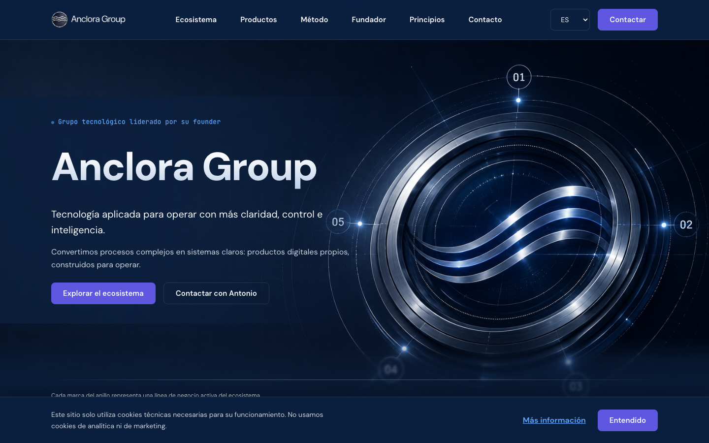

**MEASURED_BROWSER** · Hero · 1440×900 · / (build de producción) · Primera visita, banner de cookies activo. El banner ocupa 100 px y corta la leyenda «Cada marca del anillo representa una línea de negocio activa del ecosistema Anclora» exactamente por la mitad.

- **SÍ** — propuesta de valor visible
- **SÍ** — CTA primario visible
- **NO** — prueba visible
- **819 px** — altura del hero (1440×900)
- **81 px** — altura de cabecera
- **2** — CTA en el hero

| Criterio | Valoración | Observación |
|---|---|---|
| Identificación de marca | EXCELENTE | Logo, wordmark y un H1 con el nombre del grupo. Imposible confundir de quién es la página. |
| Claridad de propósito | BUENA | «Tecnología aplicada para operar con más claridad, control e inteligencia» aparece a 435 px del borde superior, dentro del primer viewport en los cuatro tamaños. |
| Claridad de audiencia | REGULAR | Nada nombra a un destinatario. «Operar» sugiere empresa, pero ni el sector ni el tamaño ni el rol se explicitan en ninguna parte de la página. |
| Propuesta de valor | BUENA | Presente y bien escrita, pero situada en el subtítulo y no en el titular (§10). |
| Message match | BUENA | El `` y la `meta description` anticipan exactamente lo que el hero entrega. Sin campañas ni parámetros de origen que verificar. |
| Diferenciación | REGULAR | «Productos digitales propios, construidos para operar» es la única frase diferencial, y es una afirmación sin respaldo visible en pantalla. |
| Jerarquía visual | EXCELENTE | Cinco niveles limpios: eyebrow mono 13 px → H1 80 px/800 → tagline 20 px → párrafo → botones. Ningún nivel compite con otro. |
| Acción primaria | REGULAR | El botón relleno del hero compite con el botón «Contactar», también relleno y en el mismo púrpura, en la cabecera sticky, presente en todo momento (§15). |
| Señal de scroll | REGULAR | El anillo se corta por el borde inferior e invita a bajar, pero el indicador explícito (SectionNav) solo aparece tras el primer desplazamiento. |
| Densidad de contenido | BUENA | Un titular, dos frases, dos botones y una leyenda. Restringido, no vacío. |

> **¿Puede un visitante primerizo explicar Anclora tras 5–10 segundos?**

**Sí, a medias.** Puede decir «un grupo tecnológico español, liderado por su fundador, que hace software para que las empresas operen con más claridad». No puede decir para quién es, ni qué producto le tocaría, ni por qué debería creerlo. Las tres cosas llegan más abajo — y las dos últimas nunca del todo.

## 10 · Eficacia del hero

El hero es la pieza mejor ejecutada de la página y, a la vez, la que más rendimiento deja sin recoger.

### Lo que funciona

- **El anillo es un activo de marca real.** No es una ilustración de stock ni un degradado abstracto: es una pieza específica de Anclora, con cinco nodos numerados que codifican información verdadera — las cinco líneas de negocio. Es la única decisión visual de toda la página que ningún competidor podría reutilizar.
- **Economía tipográfica.** 80 px/800 con `letter-spacing` negativo y relleno de degradado vertical sutil (#F8FAFC → #A9C0E4); ni sombra, ni contorno, ni brillo. Contención premium.
- **Dos CTA, no cinco.** Uno para explorar, otro para hablar. Es la jerarquía correcta para un grupo que no vende autoservicio.

### Lo que no

- **El titular gasta su peso en el nombre.** «Anclora Group» a 80 px ocupa el punto de mayor atención de la página para decir algo que el logo, la cabecera, la pestaña del navegador y el propio dominio ya dicen. La frase que sí trabaja — «Tecnología aplicada para operar con más claridad, control e inteligencia» — se sirve a 20 px, cuatro veces más pequeña.
- **El visual gana al mensaje en anchos intermedios.** A 768 px el anillo se recorta por la derecha, el nodo 02 desaparece por completo, el 05 queda detrás de los botones y la leyenda que descodifica los números cae fuera de pantalla. El visual pasa a ser textura.
- **El punto del eyebrow queda huérfano en móvil.** A 390 px el texto del eyebrow se centra pero su viñeta permanece anclada al margen izquierdo, a unos 170 px del texto que acompaña.

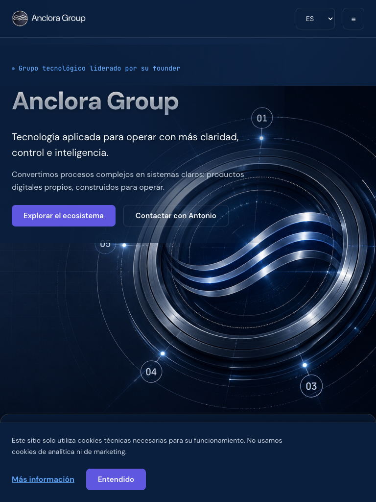

**MEASURED_BROWSER** · Hero · 768×1024 · / · Anillo recortado: el nodo 02 sale de pantalla, el 05 queda tras el CTA secundario y la leyenda de líneas cae bajo el pliegue.

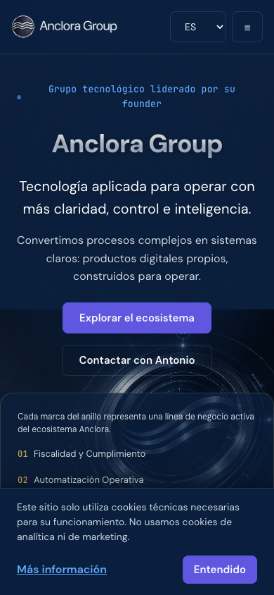

**MEASURED_BROWSER** · Hero · 390×844 · / · Primera visita. El banner mide 152 px y oculta las líneas 03, 04 y 05. Obsérvese la viñeta del eyebrow, aislada en el margen izquierdo.

### Comprobación anti-slop

Ninguno de los patrones de riesgo aparece: no hay copy genérico de IA («Empowering businesses to unlock…»), no hay reclamo abstracto sin sustantivo, no hay muro de texto, no hay acumulación de logos y no hay estética tecnológica decorativa por sí misma. La única marca de exceso es la desproporción entre el peso del nombre y el peso de la promesa.

## 11 · Propuesta de valor y diferenciación

Anclora Group no vende un producto: vende la existencia de un sistema. Por eso «oferta» debe leerse como qué ofrece el grupo como grupo.

| Dimensión | Valoración | Fundamento |
|---|---|---|
| Claridad de propósito | BUENA | «Convertimos procesos complejos en sistemas claros» es concreto y verificable como intención. |
| Claridad de oferta | REGULAR | Queda claro **qué construye** Anclora; no queda claro **qué puede contratar, probar o comprar** el visitante hoy. Los once productos aparecen como «ecosistema interno». |
| Propuesta de valor | BUENA | Coherente y repetida sin redundancia entre hero, Ecosystem y Contacto. |
| Message match | BUENA | Metadatos, hero y cuerpo dicen lo mismo. |
| Diferenciación | REGULAR | Lo diferencial está en el **Método** y los **Principios**, que llegan en la posición 5 y 7 de 8. Lo que se ofrece antes — un grupo con varias líneas y varios productos — es la descripción de cualquier holding tecnológico. |

> **¿Comprende el visitante el grupo antes de que se le pida explorar productos?**

**Sí.** La secuencia hero → Evidence → Ecosystem entrega el modelo mental completo (cinco líneas, un sistema de control común) antes de nombrar el primer producto. Es una de las decisiones de arquitectura de contenido mejor tomadas de la página.

## 12 · Evidencia, prueba y confianza

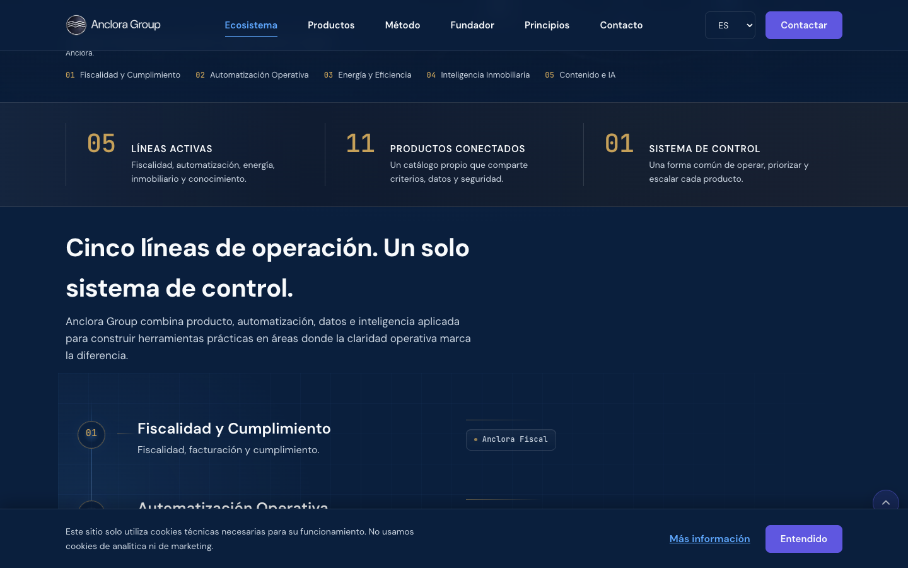

**MEASURED_BROWSER** · Evidence + Ecosystem · 1440×900 · /#ecosystem · Las tres cifras de la franja de evidencia cuentan elementos de la propia página, no hechos externos.

La skill obliga a distinguir cuatro cosas que suelen confundirse: **señal de confianza**, **prueba**, **afirmación** y **decoración**. Aplicado a esta franja:

| Elemento | Clasificación | Por qué |
|---|---|---|
| **05** Líneas activas | AFIRMACIÓN | Cuenta las cinco secciones que la propia página muestra debajo. Un visitante escéptico no puede verificarlo ni le dice nada que no vaya a ver en veinte segundos. |
| **11** Productos conectados | AFIRMACIÓN | Cuenta las once tarjetas de la sección Productos. «Conectados» es además la palabra más fuerte de la franja y la única sin ninguna demostración. |
| **01** Sistema de control | SEÑAL DE CONFIANZA | No es una cifra: es una postura («una forma común de operar, priorizar y escalar»). Funciona como mensaje, no como métrica, y el formato numérico la disfraza de dato. |
| Retrato y biografía del founder | PRUEBA | Persona identificable, especialidad concreta, ubicación concreta. Es la evidencia más fuerte de la página. |
| Método de cuatro fases | PRUEBA | Describe un procedimiento comprobable en el trato, no un valor abstracto. |

> **¿Reduce la evidencia el escepticismo, o solo añade cifras?**

Hoy añade cifras. Ninguna de las tres es externa, fechada ni verificable, y las tres son deducibles del propio scroll. Una cifra grande no es prueba por ser grande. Lo que sí reduciría escepticismo — un producto en producción visitable, un cliente, un año de actividad, una cifra de operaciones procesadas — no está presente en ninguna parte de la página.

#### Riesgos de confianza detectados

- AFIRMACIÓN SIN RESPALDO «Productos conectados» y «comparten los mismos datos, la misma seguridad y la misma forma de trabajar» describen integración técnica sin ningún elemento inspeccionable.
- ENLACE MUERTO FUNCIONAL Seis CTAs que prometen producto y entregan contacto (§14).
- IDENTIDAD LEGAL INCONSISTENTE El Aviso Legal declara que «incluirá la información legal de identificación de Anclora Group». Hoy no la incluye (§33).
- CONTACTO FRÁGIL Un único canal, una única dirección personal, sin alternativa si falla.

## 13 · Claridad del ecosistema

Es el punto donde una landing corporativa multiproducto suele fallar, y donde ésta acierta.

| Dimensión | Valoración | Fundamento |
|---|---|---|
| Modelo mental | EXCELENTE | «Cinco líneas de operación. Un solo sistema de control.» El titular **es** el modelo mental; el resto de la sección lo instancia. |
| Agrupación | BUENA | Cinco líneas, cada una con productos nombrados. La misma taxonomía se repite en el anillo del hero, en Ecosystem y en la etiqueta de categoría de cada tarjeta de producto: tres representaciones, cero contradicciones. |
| Nomenclatura | REGULAR | Las líneas se nombran en inglés en los datos (Fiscal & Compliance, Content & AI) y en castellano en pantalla, lo que es correcto. El problema es la cantidad: cinco categorías nuevas más once marcas nuevas, dieciséis nombres propios que aprender en una sola visita. |
| Relaciones | BUENA | La relación línea → producto es explícita. La relación producto → producto («conectados») se afirma pero no se muestra. |
| Jerarquía | REGULAR | Los datos distinguen dos niveles (`tier: 1` y `tier: 2`) y el nivel 3 se omite deliberadamente por contrato de marca. En pantalla la diferencia entre niveles se reduce a un tamaño de encabezado (h3 frente a h4): la jerarquía existe en el modelo, apenas en la percepción. |
| Descubribilidad | POBRE | Ningún elemento del ecosistema es explorable. Se entiende el mapa; no se puede pisar el terreno. |
| Carga cognitiva | REGULAR | Dieciséis nombres propios sin ninguna ayuda de priorización. |

> **¿Entiende un visitante nuevo cómo encajan las piezas?**

**Sí.** Es el mejor resultado de la auditoría. Lo que no puede hacer es decidir cuál de esas piezas le importa.

## 14 · Descubrimiento de producto

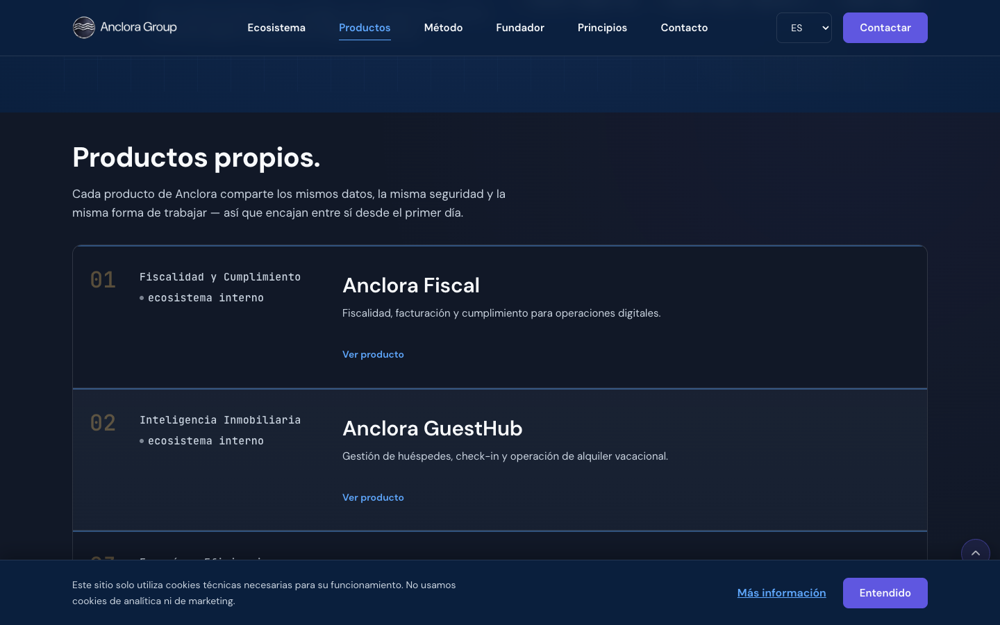

**MEASURED_BROWSER** · Products · 1440×900 · /#products · Todas las fichas comparten estado («ecosistema interno»), peso visual y CTA. La mitad derecha del contenedor queda sin contenido.

### Mapa de integridad de enlaces de producto

Se inspeccionaron los once productos y se verificó cada CTA en navegador, no solo su `href`.

| Producto | Nivel | Etiqueta | Destino observado | Estado | Nota |
|---|---|---|---|---|---|
| Anclora Fiscal | 1 | Ver producto | #contact | AUTORREFERENCIA | Sin `productUrl` en datos; `ProductCard.tsx` aplica el fallback documentado a `#contact`. El enlace funciona; la etiqueta miente. |
| Anclora GuestHub | 1 | Ver producto | #contact | AUTORREFERENCIA |
| Anclora EnergyScan | 1 | Ver producto | #contact | AUTORREFERENCIA |
| Anclora Private Estates | 1 | Ver producto | #contact | AUTORREFERENCIA |
| Anclora Insights ADN | 1 | Ver producto | #contact | AUTORREFERENCIA |
| Anclora Content Generator AI | 1 | Ver producto | #contact | AUTORREFERENCIA |
| Anclora Talent | 1 | «en pausa» | — (deshabilitado) | CORRECTO | Único producto con URL real (`talent.anclora.com`), deliberadamente no expuesta como afordancia activa. Decisión bien tomada y bien comentada en código. |
| Anclora Nexus | 2 | — | — | SIN CTA | Nivel 2 se presenta sin CTA. Coherente: son capas internas, no productos comprables. |
| Anclora Command Center | 2 | — | — | SIN CTA |
| Anclora Synergi | 2 | — | — | SIN CTA |
| Anclora Data LAB | 2 | — | — | SIN CTA |

**Verificación de clic:** pulsar «Ver producto» en Anclora Fiscal desplaza la ventana de y=1.984 a y=6.398 y fija la URL en `/#contact`. El desplazamiento es correcto (la sección aterriza a 81 px, compensando la cabecera) y el botón «atrás» del navegador restaura la posición previa. La mecánica es impecable; el destino, no.

> **¿Puede un visitante decidir qué producto de Anclora le interesa?**

**No.** Cada ficha ofrece una descripción de una línea, un estado idéntico al de todas las demás y un botón que lleva al mismo sitio. No hay captura de pantalla, ni caso de uso, ni «para quién es», ni precio, ni disponibilidad. La decisión que la sección pide al visitante no tiene información suficiente para tomarse.

## 15 · Arquitectura de CTA

- **21** — enlaces totales
- **3** — CTA primarios
- **7** — CTA secundarios
- **ALTA** — competencia de CTA
- **10** — CTA que resuelven a #contact
- **1** — destinos externos reales

| Sección | Etiqueta | Tipo | Destino | Peso visual | Resultado |
|---|---|---|---|---|---|
| Cabecera | Contactar | Primario | #contact | Relleno púrpura | Persistente en todo el scroll |
| Cabecera | 6 anclas de sección | Navegación | #… | Texto | Correcto, con estado activo |
| Hero | Explorar el ecosistema | Primario | #ecosystem | Relleno púrpura | Correcto |
| Hero | Contactar con Antonio | Secundario | #contact | Contorno | Correcto |
| Products ×6 | Ver producto | Secundario | #contact | Enlace azul | Etiqueta engañosa |
| Contacto | Contactar con Antonio | Primario | mailto: | Relleno púrpura | Correcto, sin competencia |
| Footer | 4 enlaces legales + email | Utilidad | /privacy… | Texto 21 px alto | Bajo el mínimo táctil (§30) |
| Flotante | SectionNav ↑ ↓ | Navegación | — | Botón circular 42 px | Correcto, con `aria-label` |

#### Competencia de CTA

Hay un solo conflicto real y es persistente: el botón **«Contactar»** de la cabecera y el CTA primario de cada sección comparten el mismo tratamiento — relleno púrpura de marca, mismo radio, mismo peso. En el primer viewport eso significa dos botones rellenos púrpura simultáneos que piden acciones distintas, y el de la cabecera, al ser sticky, acompaña al visitante durante todo el recorrido compitiendo con lo que la sección esté proponiendo en cada momento. Un tratamiento de contorno o fantasma en la cabecera resolvería el conflicto sin perder la afordancia.

> **¿Hay una siguiente mejor acción clara en cada punto de decisión?**

**En cinco de las ocho secciones, sí.** Falla exactamente donde más importa: en Productos, donde la siguiente acción está etiquetada como una cosa y hace otra; y en Método, Founder y Principios, que terminan sin ninguna acción — el visitante convencido por el relato debe volver a buscar el botón de la cabecera.

## 16 · Ruta de conversión

| Etapa | Dónde ocurre | Estado | Observación |
|---|---|---|---|
| **Descubrir** | Hero | SÓLIDA | Marca, promesa y dos salidas en la primera pantalla. |
| **Entender** | Evidence → Ecosystem | SÓLIDA | Modelo mental completo antes del primer nombre de producto. |
| **Confiar** | Método → Founder → Principios | PARCIAL | La confianza se construye, pero llega **después** de Productos: el visitante debe decidir sobre productos antes de tener motivos para creer en quien los hace. |
| **Explorar** | Products | ROTA | No hay nada que explorar. La etapa existe en la narrativa y no en la interfaz. |
| **Contactar** | Contact | PARCIAL | Un único canal, sin fricción pero también sin red de seguridad. |

El defecto estructural es de orden: **Productos (posición 4) llega antes que la confianza (posiciones 5–7)**. La página pide la decisión antes de haber dado los argumentos, y cuando por fin los da, ya no vuelve a ofrecer la decisión.

## 17 · Método

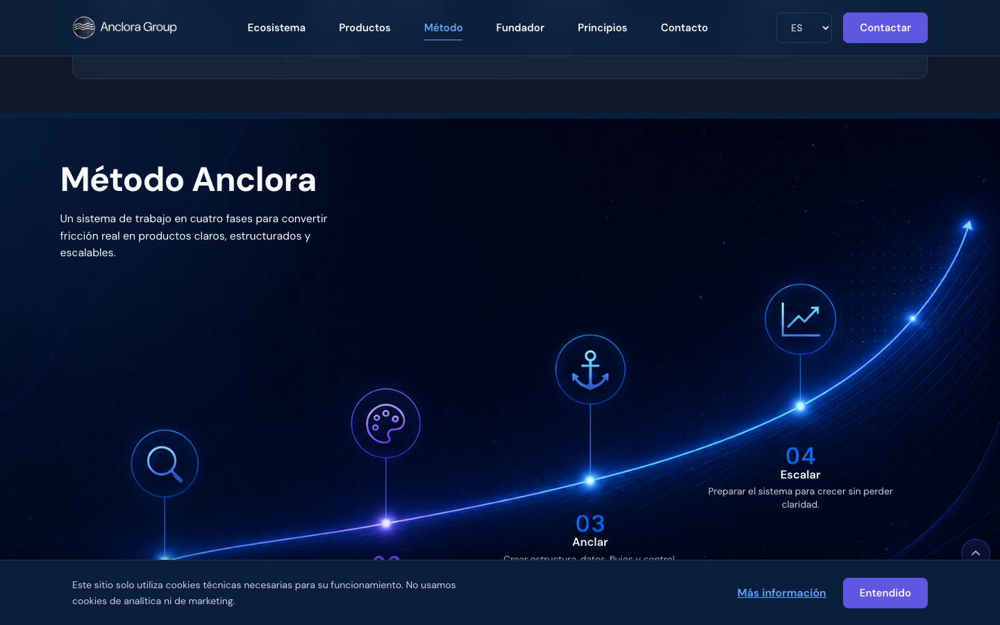

**MEASURED_BROWSER** · Method · 1440×900 · /#method · Las fases 01 y 02 quedan bajo el banner de cookies en la primera visita. Los numerales aquí son azul señal; en Evidence, Ecosystem y Principios son dorados.

| Dimensión | Valoración | Fundamento |
|---|---|---|
| Especificidad | BUENA | «Detectar fricción real y contexto operativo» / «Crear estructura, datos, flujos y control» son acciones, no adjetivos. |
| Diferenciación | BUENA | «Anclar» como fase propia — dar estructura y control antes de escalar — es una postura de ingeniería identificable y consistente con el nombre del grupo. |
| Comprensibilidad | BUENA | Cuatro fases, cuatro verbos, una línea cada una. |
| Relación con los productos | REGULAR | El método no se conecta con ningún producto concreto. Se afirma la existencia de un modo de trabajar; no se muestra su resultado. |
| Valor de confianza | BUENA | Es la segunda mejor prueba de la página tras el founder. |
| Extensión | EXCELENTE | Una pantalla. Sin relleno. |
| Posición | REGULAR | Llega después de Productos, cuando ya se ha pedido la decisión. |

> **¿Demuestra el Método una forma distinta de trabajar, o solo añade lenguaje corporativo?**

**Demuestra.** Es lenguaje operativo, no corporativo: cuatro verbos de trabajo real, sin una sola palabra de relleno de consultoría. Es, junto a Principios, lo que separa esta página de la landing de cualquier otro grupo tecnológico.

## 18 · Fundador

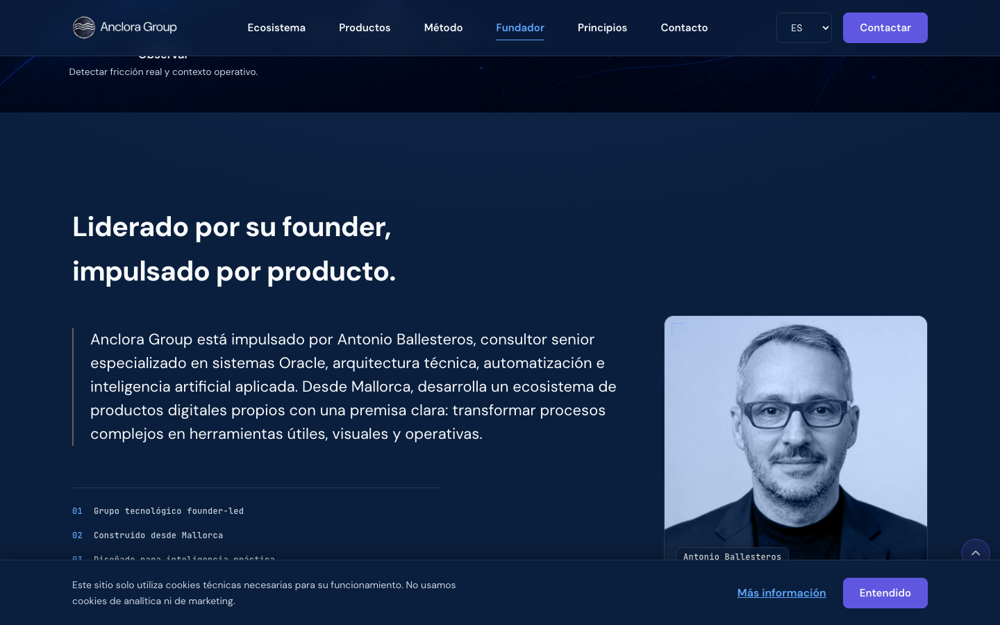

**MEASURED_BROWSER** · Founder · 1440×900 · /#founder · Persona identificable, especialidad concreta y ubicación concreta: la evidencia más fuerte de toda la página.

La sección hace exactamente lo que debe: pone una cara y un nombre donde el resto de la página pone abstracciones, y lo hace con contención — un retrato, un párrafo, tres marcadores. El titular «Liderado por su founder, impulsado por producto» es además una respuesta preventiva a la objeción natural: ¿esto es una persona o una empresa?

| Dimensión | Valoración | Fundamento |
|---|---|---|
| Confianza humana | EXCELENTE | Retrato real, nombre real, especialidad verificable. |
| Credibilidad | BUENA | «Consultor senior especializado en sistemas Oracle, arquitectura técnica, automatización e IA aplicada» es específico y comprobable fuera de la página… si hubiera algún enlace para comprobarlo. No lo hay. |
| Equilibrio marca personal / marca grupo | REGULAR | El propio titular reconoce el riesgo y lo compensa. Pero el resto de la página lo desequilibra: el CTA se llama «Contactar con Antonio», el correo es personal y no hay ninguna otra persona ni equipo mencionado. |
| Extensión del relato | EXCELENTE | Cuatro frases. Sin épica fundacional. |
| Relación con CTA | REGULAR | La sección no ofrece acción. El visitante convencido aquí debe subir a la cabecera o seguir bajando tres secciones más. |

> **¿Refuerza el relato founder-led a Anclora, o hace que el grupo dependa de una persona?**

**Refuerza — y el riesgo está identificado pero no cerrado.** Para un cliente pequeño o un socio, hablar directamente con quien decide es una ventaja explícita («sin intermediarios»). Para un contacto de negocio que evalúa continuidad, la ausencia total de equipo, estructura o segunda persona es la objeción que la página no responde en ningún punto.

## 19 · Principios

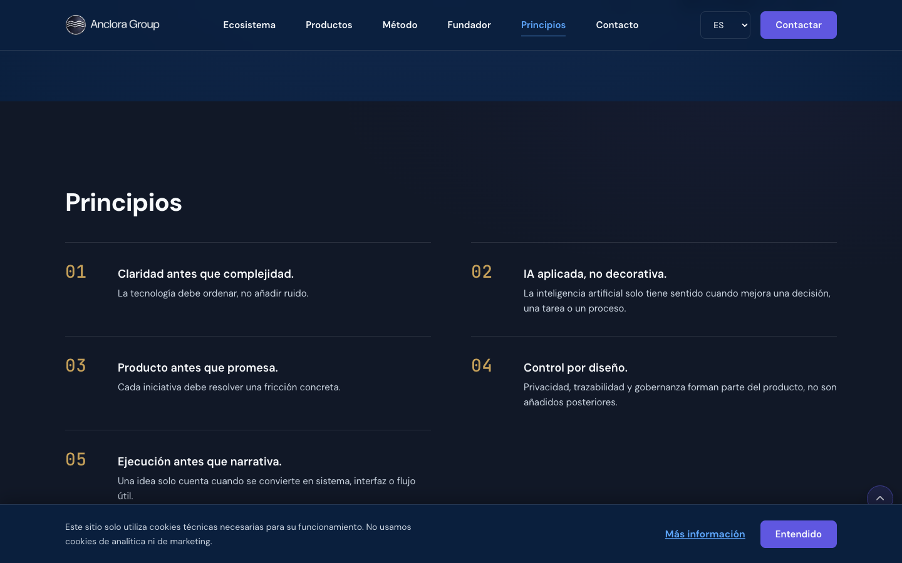

**MEASURED_BROWSER** · Principles · 1440×900 · /#principles · Rejilla de dos columnas; el principio 05 queda solo en la columna izquierda con la derecha vacía.

Son principios reales, no valores corporativos. La prueba es que cada uno **excluye** algo: «IA aplicada, no decorativa» rechaza una práctica concreta y extendida; «Producto antes que promesa» y «Ejecución antes que narrativa» son afirmaciones que un competidor podría razonablemente no suscribir. Un valor genérico («Excelencia», «Innovación») no excluye nada, y por eso no informa.

| Dimensión | Valoración | Fundamento |
|---|---|---|
| Memorabilidad | BUENA | Construcción paralela «X antes que Y» en tres de los cinco: fácil de retener. |
| Especificidad | EXCELENTE | Cada principio nombra una decisión concreta. |
| Diferenciación | BUENA | Son postura, no consenso. |
| Repetición | REGULAR | «Claridad antes que complejidad» reformula lo ya dicho en hero, Ecosystem y el titular de Contacto («Construyamos con claridad»). La idea aparece cuatro veces. |
| Accionabilidad | REGULAR | Ninguno se traduce en algo que el visitante pueda hacer o comprobar. |
| Jerarquía visual | BUENA | Numeral + título + descripción, con separadores finos. El quinto elemento huérfano rompe levemente la rejilla. |

## 20 · Contacto y fricción de formulario

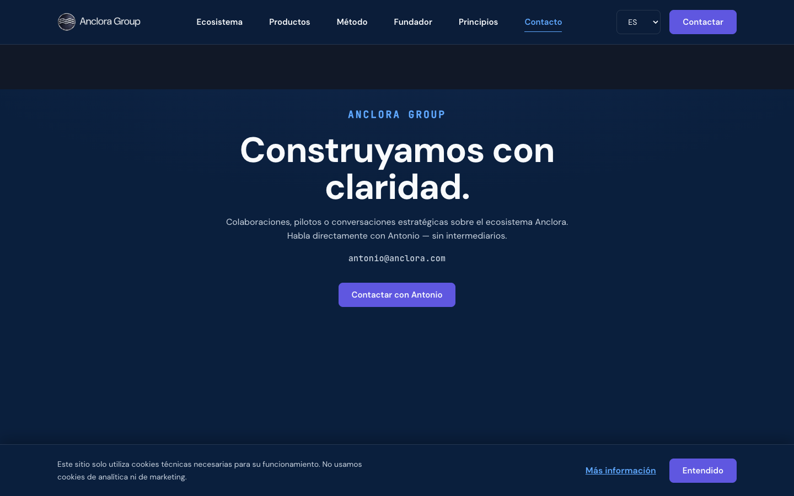

**MEASURED_BROWSER** · Contact · 1440×900 · /#contact · Sin formulario. El correo mostrado bajo el párrafo es un `
`, no un enlace. Unos 330 px de la pantalla final quedan vacíos.

- **0** — campos de formulario
- **0** — campos obligatorios
- **NINGUNA** — fricción de cumplimentación
- **1** — canales de contacto
- **NO** — expectativa de respuesta
- **NO** — canal alternativo

#### Lectura de la decisión

No tener formulario es una decisión defendible para un grupo que busca conversaciones y no leads: elimina campos, validación, consentimiento, spam y toda la superficie de error asociada. La skill exige evaluar la ausencia, no penalizarla automáticamente. Evaluada, tiene dos costes concretos:

- **Fallo silencioso.** Un `mailto:` en un equipo sin cliente de correo configurado — habitual en escritorios corporativos que usan solo webmail — no hace nada visible. El visitante interpreta que el botón está roto y no hay segunda vía.
- **Copia manual.** La dirección que se muestra en la sección no es un enlace ni tiene control de copiado. Quien prefiera escribir desde su propio webmail debe seleccionarla a mano.

#### Pruebas realizadas hasta el punto seguro

Se verificó el foco, el estado deshabilitado del CTA de Anclora Talent y el `rel="noopener noreferrer"` de los destinos externos. **No se envió ningún correo ni se disparó ningún efecto externo** — SAFETY_BLOCKED, conforme a la restricción de esta ejecución.

## 21 · Secuencia de contenido y narrativa de scroll

- **8** — secciones
- **7.644 px** — scroll total · 1440×900
- **9.259 px** — scroll total · 768×1024
- **10.594 px** — scroll total · 390×844
- **900 px** — primera «prueba» (Y)
- **2.126 px** — primer producto (Y)
- **6.479 px** — CTA final (Y)
- **—** — primer formulario (no existe)

#### ¿Se gana cada sección la siguiente?

| Pos. | Sección | Veredicto | Observación |
|---|---|---|---|
| 1 | Hero | SÍ | Introduce las cinco líneas y crea la pregunta que Ecosystem responde. |
| 2 | Evidence | DÉBIL | Repite en cifras lo que el hero acaba de decir en palabras. Es la sección con menor rendimiento por píxel de la página. |
| 3 | Ecosystem | SÍ | Entrega el modelo mental y abre legítimamente Productos. |
| 4 | Products | PARCIAL | Cumple listando, falla al pedir una decisión sin dar información ni destino. |
| 5 | Method | SÍ | Responde a la pregunta que Productos deja abierta: ¿cómo se construye esto? |
| 6 | Founder | SÍ | Responde a ¿quién lo construye? |
| 7 | Principles | PARCIAL | Refuerza, pero solapa con Método y con el propio hero en la idea de «claridad». |
| 8 | Contact | SÍ | Cierre limpio y aislado. |

#### Patrones detectados

- PRUEBA DEMASIADO TARDE La prueba real (Método, Founder) llega en las posiciones 5 y 6, después de la sección que pide decidir.
- REDUNDANCIA «Claridad» como concepto aparece en el hero, en Ecosystem, en el principio 01 y en el titular de Contacto.
- SECCIÓN DE BAJO RENDIMIENTO Evidence ocupa una franja completa para tres afirmaciones autorreferenciales.
- FATIGA DE SCROLL EN MÓVIL 12,5 pantallas, de las que Productos consume 4.
- SIN CTA PREMATURO No se pide conversión antes de haber explicado. Correcto.

> **¿Crea el scroll progreso, o solo longitud?**

**Progreso, con una meseta.** El tramo Hero→Ecosystem y el tramo Método→Contacto avanzan de verdad. Entre ambos, Productos ocupa el 25% del recorrido total repitiendo siete veces la misma fila con distinto nombre.

## 22 · Experiencia de marca

| Dimensión | Valoración | Evidencia |
|---|---|---|
| Reconocimiento | EXCELENTE | Logo, wordmark y anillo comparten el mismo motivo de onda. Coherencia de identidad inmediata. |
| Memoria de marca | BUENA | El anillo metálico es el elemento que persiste (§25). |
| Coherencia | BUENA CON DESVÍO | Tokens correctos y aplicados. El desvío está en el sistema de numerales (abajo). |
| Distinción | BUENA | Ningún elemento se reconocería como perteneciente a otra marca. |
| Jerarquía de marca | REGULAR | Once submarcas Anclora, todas con el mismo peso tipográfico. El grupo no se distingue jerárquicamente de sus productos más allá del tamaño de encabezado. |

#### Verificación del brand book v2

Los ocho colores de la sección 6 del brand book están declarados en `src/styles/tokens.css` con los valores exactos, y las dos familias tipográficas — **DM Sans** y **JetBrains Mono** — se cargan y se aplican con reparto correcto: sans para narrativa, mono para etiquetas, categorías, estados y numerales. La composición mono/sans es una de las decisiones más sólidas de la página.

Un detalle a favor: el token `--command-purple-on-light-text: #5F57E0` existe precisamente porque el púrpura de marca a 3,8:1 no alcanza AA para texto de cuerpo. Alguien leyó la tabla de contraste del brand book y actuó en consecuencia. Eso es adopción real de contrato, no decorativa.

#### El desvío: dos acentos para un mismo sistema

El brand book define **Anclora Gold #C5A059** como «énfasis premium mínimo (**uso restringido**)». En la página aparece en 23 nodos de texto, todos numerales: la leyenda del anillo (01–05), las tres cifras de Evidence, los cinco numerales de Ecosystem y los cinco de Principios. En paralelo, los numerales de **Método** (01–04) y de **Founder** (01–03) usan azul señal. El resultado es un sistema de numeración con dos acentos y ninguna regla semántica que los separe: el lector no puede inferir qué significa que un número sea dorado y otro azul. No es una violación del brand book — el dorado es color de marca — pero sí una inconsistencia del sistema y una lectura amplia de «uso restringido».

## 23 · Superficie de producto premium

Premium entendido como jerarquía, contención y precisión — no como más degradados, más cristal, más sombra o más animación.

| Dimensión | Valoración | Observación |
|---|---|---|
| Composición | BUENA | Secciones a pantalla completa con rejilla estable; Founder equilibra texto y retrato con acierto. |
| Tipografía | EXCELENTE | Escala clara de cinco niveles, pesos deliberados, mono como voz técnica. Sin tipografías ajenas al contrato. |
| Espaciado | BUENA | Base 8 respetada; ritmo vertical consistente entre secciones. |
| Alineación | REGULAR | Excelente en escritorio. La viñeta del eyebrow rompe la alineación en móvil. |
| Superficies | EXCELENTE | El token `--border-subtle` impone «borde **o** sombra, nunca ambos». Se cumple. No hay glassmorphism. |
| Bordes y radios | BUENA | Dos radios en todo el sistema: 8 px para controles, 14 px para superficies. |
| Iconografía | BUENA | Solo cuatro iconos en toda la página, todos en el Método y todos con función. Ninguna fila de iconos genéricos. |
| Botones | REGULAR | Bien construidos; el problema es de jerarquía entre ellos, no de factura (§15). |
| Ritmo visual | REGULAR | Siete secciones a exactamente 100 vh menos cabecera producen una cadencia regular que, sostenida ocho veces, se vuelve previsible. |
| Medios | REGULAR | Tres piezas, todas con propósito. El problema es su peso en bytes, no su papel (§32). |
| Movimiento | BUENA | Una sola secuencia de revelado por sección, nunca por tarjeta (§29). |
| Integración de marca | BUENA | El color de marca aparece donde hay acción o dato, no como fondo decorativo. |

## 24 · Anti-template y AI-slop

Un patrón común usado correctamente no se penaliza. Lo que se evalúa es si la interfaz es distintiva por las razones adecuadas.

| Patrón de riesgo | Presente | Lectura |
|---|---|---|
| Hero genérico | NO | Visual propietario con información codificada, no una ilustración de stock. |
| Rejilla de tres columnas injustificada | NO | La franja de Evidence tiene tres columnas para tres cifras paralelas: uso correcto del patrón. La objeción es al contenido, no a la forma. |
| Tarjetas injustificadas | PARCIAL | Las once fichas de producto tienen tratamiento idéntico para elementos de importancia declaradamente distinta (nivel 1 frente a nivel 2). |
| Iconos genéricos | NO | Cuatro iconos, todos con significado. |
| Degradado arbitrario | NO | Los degradados son atmosféricos y el brand book los limita a 8% de variación. Se cumple. |
| Glassmorphism | NO | Ausente. |
| Uniformidad visual | PARCIAL | Siete secciones consecutivas de altura idéntica sobre el mismo fondo navy. |
| Borrado de marca | NO | La identidad es inequívoca en todo el recorrido. |
| Complejidad decorativa | NO | Ningún elemento existe solo para llenar. |
| Copy generado por IA | NO | Redacción específica, con opinión, sin muletillas de LLM ni superlativos vacíos. |

> **¿Es la interfaz distintiva por las razones adecuadas?**

**Sí.** Es la conclusión más clara de la auditoría. La página no parece una plantilla ni un producto generado: parece hecha por alguien con criterio, y ese criterio es visible en decisiones concretas — el reparto mono/sans, la regla de «borde o sombra», el uso del token oscurecido para cumplir contraste, el CTA deliberadamente deshabilitado de un producto en pausa. Los problemas de esta landing son de destino, contenido y prueba; no de gusto.

## 25 · Memorabilidad

| Ancla | Fuerza | Qué recordará el visitante 30 minutos después |
|---|---|---|
| **Ancla visual primaria** | FUERTE | El anillo metálico con la onda. Es el elemento que sobrevive al olvido del texto. |
| **Ancla visual secundaria** | FUERTE | La curva ascendente luminosa del Método. |
| **Ancla de mensaje** | DÉBIL | Ninguna frase está construida para repetirse. Lo más cercano es «IA aplicada, no decorativa» — que llega en la posición 7 de 8 y en cuerpo pequeño. |
| **Ancla de producto** | DÉBIL | Once nombres sin diferenciación de peso. Se recordará «tenían muchos productos», no cuáles. |
| **Ancla humana** | FUERTE | «Un tipo en Mallorca que construye su propio ecosistema de software.» Probablemente el recuerdo más nítido de toda la visita. |

**Marca memorable frente a efecto memorable:** lo que persiste aquí es marca — un motivo visual propietario y una persona — no un truco de interacción. Es el tipo correcto de memoria. La carencia es que la **proposición** no acompaña al recuerdo: se recordará quién, no qué ofrecen.

## 26 · Public site shell

No hay APPLICATION_SHELL que auditar. Sí hay cromo global, y se audita como tal.

| Elemento | Valoración | Observación |
|---|---|---|
| Cabecera (81 px, sticky) | BUENA | Proporción correcta: 9% del alto de viewport a 900 px. No compite por espacio. |
| Navegación | BUENA | Seis anclas con estado activo real, calculado por `useActiveSectionIndex` y reflejado con subrayado + color. |
| Logo | BUENA | Enlaza a `#top`. Comportamiento esperado. |
| Selector de idioma | REGULAR | `` nativo con `aria-label` — accesible y sin dependencias. Duplicado en cabecera y footer, y sin persistencia (§31). |
| SectionNav flotante | REGULAR | Botones ↑/↓ contextuales con `aria-label` traducido y actualización de hash. Funciona bien; a 42 px queda justo por encima del mínimo WCAG 2.2 pero por debajo de la recomendación de 44 px de destino táctil cómodo. |
| Control de cookies | BUENA | Reabrible desde el footer en cualquier momento, con retorno de foco correcto. |
| Footer | REGULAR | Contenido correcto; los objetivos táctiles de 21 px de alto incumplen WCAG 2.2 AA 2.5.8 (§30). |
| Enlace de salto al contenido | AUSENTE | No existe. Con nueve elementos focalizables antes del contenido principal, es un incumplimiento de WCAG 2.4.1. |

> **¿Apoya el cromo global a la landing o compite con ella?**

**Apoya, con una excepción.** La cabecera es discreta y la SectionNav ayuda de verdad en una página de ocho pantallas. La excepción es el botón «Contactar» de la cabecera, que al ser relleno púrpura compite permanentemente con el CTA primario de cada sección (§15).

## 27 · Mapa de densidad visual

| Sección | Contenido | Controles | Decorativa | Medios | CTA | Clasificación |
|---|---|---|---|---|---|---|
| Hero | Media | Baja | Alta | Alta | 2 | BIEN EQUILIBRADA |
| Evidence | Baja | Nula | Baja | Nula | 0 | INFRAINFORMADA |
| Ecosystem | Media | Nula | Media | Baja | 0 | BIEN EQUILIBRADA |
| Products | Media | Baja | Baja | Nula | 6 | INFRAINFORMADA · SOBREEXTENDIDA |
| Method | Baja | Nula | Alta | Alta | 0 | BIEN EQUILIBRADA |
| Founder | Media | Nula | Baja | Media | 0 | BIEN EQUILIBRADA |
| Principles | Media | Nula | Baja | Nula | 0 | BIEN EQUILIBRADA |
| Contact | Baja | Baja | Baja | Nula | 1 | INFRAINFORMADA |
| Footer | Baja | Media | Nula | Nula | 5 | BIEN EQUILIBRADA |

Ninguna sección está sobrediseñada ni sobredensificada — un resultado poco común y a favor de la página. El patrón dominante es el contrario: **tres secciones infrainformadas**, de las cuales dos (Products y Contact) son precisamente las que soportan la conversión.

## 28 · Responsive y conversión móvil

| Viewport | Cubierto | Overflow horizontal | Scroll total | Observación |
|---|---|---|---|---|
| 390×844 | SÍ | No | 10.594 px | Menú hamburguesa correcto; CTA primario visible sin scroll; viñeta de eyebrow desalineada; 12,5 pantallas de recorrido. |
| 768×1024 | SÍ | No | 9.259 px | Peor caso del anillo: nodo 02 fuera de pantalla, leyenda bajo el pliegue. |
| 1366×768 | SÍ | No | — | Las cuatro fases del Método caben (641 px de 687 disponibles). Sin recorte. |
| 1440×900 | SÍ | No | 7.644 px | Viewport de referencia. Todas las capturas principales. |
| 430×932 | NO | — | — | No probado. Muy próximo a 390×844; riesgo bajo pero declarado como laguna. |
| 1024×768 | NO | — | — | No probado. Franja entre el punto de ruptura móvil y escritorio; laguna declarada. |
| 1728×1117 | NO | — | — | No probado. Laguna declarada. |
| Móvil apaisado | NO | — | — | No probado. Con secciones a 100 vh, es el escenario de mayor riesgo de recorte no verificado. |

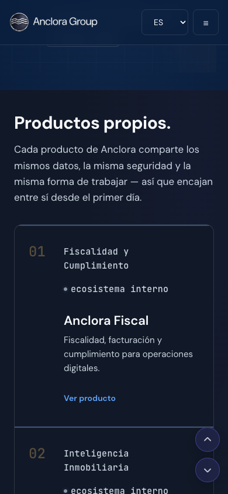

**MEASURED_BROWSER** · Products · 390×844 · /#products · 3.380 px solo para esta sección: cuatro pantallas de fichas casi idénticas.

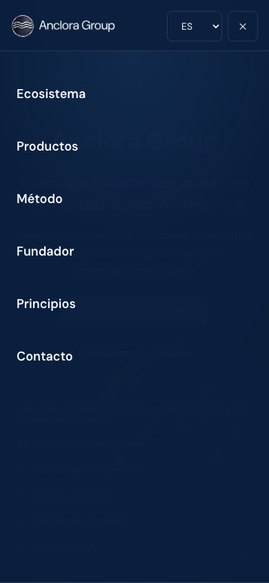

**MEASURED_BROWSER** · Menú móvil · 390×844 · / · Panel completo con `aria-expanded`, botón «Cerrar menú» etiquetado y navegación con `aria-label` propio.

### Métricas de conversión móvil

- **SÍ** — CTA primario visible sin scroll
- **782 px** — altura de hero (de 844)
- **ALTA** — fatiga de scroll
- **12,5** — pantallas de recorrido
- **152 px** — banner de cookies
- **6** — objetivos táctiles 

#### Defectos responsive observados

- SOLAPAMIENTO STICKY El banner de cookies (152 px en móvil, 100 px en escritorio) se superpone al último 18% del hero durante la primera visita, ocultando las líneas 03, 04 y 05 de la leyenda del anillo.
- RECORTE A 768 px el anillo pierde un nodo completo.
- ALINEACIÓN Viñeta del eyebrow separada de su texto en móvil.
- OBJETIVOS TÁCTILES Seis enlaces de 21 px de alto en el footer y seis CTA de producto de 30 px.
- SIN OVERFLOW Ningún desbordamiento horizontal en ninguno de los cuatro viewports probados, incluida la versión alemana.
- SIN TRAMPAS DE SCROLL No se detectó bloqueo de scroll ni scroll anidado no deseado.

## 29 · Movimiento

| Aspecto | Valoración | Observación |
|---|---|---|
| Carga de página | BUENA | Sin secuencia de entrada teatral. La página aparece. |
| Revelado al scroll | EXCELENTE | `useRevealOnScroll` aplica **un observer por sección, nunca por tarjeta**, con umbral 0,15 y desactivación tras el primer disparo. Un momento orquestado, no efectos dispersos. La decisión está además documentada en el propio código. |
| Hover | BUENA | Transiciones de 160–220 ms con curvas tokenizadas. |
| Movimiento de CTA | BUENA | Sin pulsos ni rebotes que reclamen atención. |
| Movimiento decorativo | BUENA | Ninguno. Sin parallax. |
| Transiciones de sección | BUENA | El desplazamiento por SectionNav es suave y compensa la cabecera con precisión (aterrizaje a 81–82 px). |
| `prefers-reduced-motion` | EXCELENTE | Respetado en dos capas: dos bloques de CSS que reducen duraciones a 1e-05s, y el hook que marca la sección como visible **sin llegar a observar**. Verificado en navegador con la preferencia activada: contenido visible, sin animación pendiente. |
| Jank | NO DETECTADO | CLS medido 0. Sin bloqueo de interacción durante el revelado. |

> **¿El movimiento aclara, enfatiza o solo decora?**

**Enfatiza, y sabe cuándo callarse.** Es la dimensión mejor resuelta de la auditoría. La regla «un momento por sección, nunca por tarjeta» es exactamente la decisión que separa una landing premium de una llena de efectos.

## 30 · Accesibilidad

Auditoría automática con axe-core 4.12.1 más verificación manual en navegador. Ningún resultado se declara a partir del análisis estático únicamente.

- **0** — violaciones axe (1440)
- **0** — violaciones axe (390)
- **42 / 38** — reglas superadas (1440 / 390)
- **138** — nodos de contraste incompletos
- **1** — incumplimiento manual confirmado
- **6** — objetivos táctiles bajo mínimo

| Aspecto | Resultado | Verificación |
|---|---|---|
| Landmarks | CORRECTO | `header`, `main`, `footer`, `nav` con `aria-label` distinto por navegación («Navegación principal», «Navegación móvil», «Legal»), y `region` etiquetada en Evidence, Método y cookies. |
| Encabezados | CORRECTO | Un solo `h1`, siete `h2` de sección, jerarquía descendente sin saltos. |
| Teclado | CORRECTO | Recorrido completo por tabulación verificado elemento a elemento; orden lógico y coincidente con el orden visual. |
| Indicador de foco | EXCELENTE | Contorno de 2 px en azul señal con desplazamiento de 2 px, idéntico en todos los enlaces y botones. Nunca suprimido. |
| Modal de cookies | EXCELENTE | Foco atrapado en ambos sentidos, Escape cierra, foco devuelto al disparador. Implementación manual correcta y verificada. |
| Selector de idioma | CORRECTO | `` nativo etiquetado. `` se actualiza al cambiar. |
| Texto alternativo | CORRECTO | El retrato del founder tiene alternativa; los SVG decorativos llevan `aria-hidden` y `focusable="false"`. |
| Enlace de salto | INCUMPLE | **WCAG 2.4.1 (A).** Ausente. Nueve elementos focalizables preceden al contenido en escritorio. |
| Tamaño de objetivo | INCUMPLE | **WCAG 2.2 AA 2.5.8.** Enlaces legales del footer a 21 px de alto (mínimo 24); CTA de producto a 30 px, aceptables por el mínimo pero por debajo de los 44 px cómodos. |
| Contraste | NO CONCLUYENTE | axe no puede calcular 138 nodos porque el texto se apoya en imágenes de fondo y degradados. Verificación manual de tokens: todos los pares declarados cumplen la tabla del brand book. **Riesgo residual real**: el texto del hero sobre la zona luminosa del anillo a anchos intermedios. |
| `h1` con relleno de degradado | RIESGO | El `h1` usa `background-clip: text` con `color: transparent`. En modo de colores forzados o si el recorte falla, el titular principal desaparece. |
| Movimiento reducido | EXCELENTE | Ver §29. |

**Skill compuesta:** `accessibility-audit` se ejecutó sobre el repositorio y devolvió PASS sin incidencias — pero su alcance es estático (semántica, etiquetas, formularios). El incumplimiento del enlace de salto y el de tamaño de objetivo **solo aparecieron en navegador real**. Es la razón exacta por la que la skill prohíbe declarar accesibilidad completa a partir de un escaneo estático.

## 31 · Internacionalización

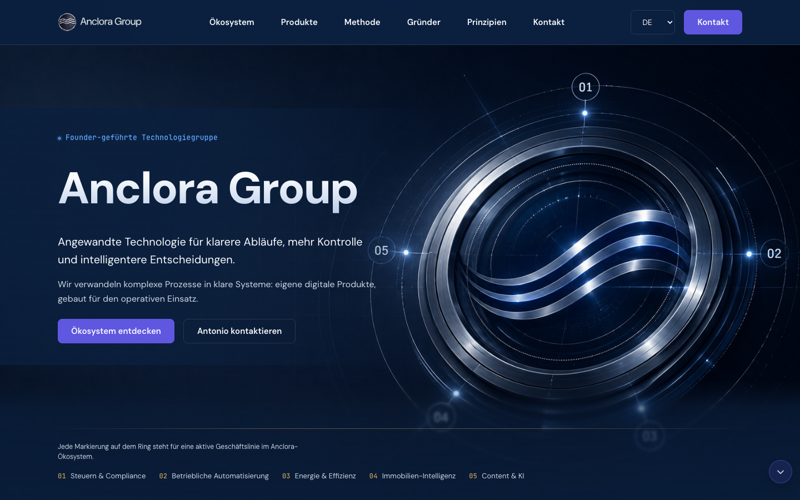

**MEASURED_BROWSER** · Hero · 1440×900 · locale de · Sin desbordamiento, sin corte de línea en la navegación, sin truncamiento pese a la expansión típica del alemán.

| Locale | Profundidad | Resultado | Observación |
|---|---|---|---|
| es | Completa | CORRECTO | Locale por defecto; base del recorrido completo. |
| en | Completa | CORRECTO | Navegación, hero y productos traducidos; posición de scroll conservada al cambiar (2.045 → 2.018 px). |
| de | Completa | CORRECTO | Navegación 664 px de ancho sin salto de línea; `scrollWidth` = `clientWidth` = 1440. |
| ca · fr · it | Smoke | CORRECTO | Presentes en el selector, con diccionario completo verificado en código y por test de regresión. |

#### Integridad

- SIN CLAVES FALTANTES La interfaz `Dictionary` obliga a paridad en compilación, y `dictionaries.test.ts` falla explícitamente si se añade una línea o un producto sin traducir en los seis locales. Es una buena práctica que conviene preservar.
- SIN CLAVES CRUDAS NI MEZCLA DE IDIOMAS No se observó ninguna clave sin resolver ni texto en idioma ajeno al seleccionado.
- SIN EXPANSIÓN DE LAYOUT Alemán —el caso peor— no rompe navegación, CTA ni tarjetas.
- SIN PERSISTENCIA La preferencia de idioma vive solo en estado de React. Al recargar, un usuario alemán vuelve a español. No hay `localStorage`, ni cookie, ni detección de `navigator.language`.
- SIN URL POR IDIOMA Los seis `hreflang` de `index.html` apuntan a la **misma** URL. Una página en alemán no es compartible ni indexable como tal; el marcado `hreflang` es, en la práctica, incorrecto.
- DERIVA DE CONTRATO La política de cookies declara que se usan cookies técnicas para «preferencia de idioma». No existe tal cookie: se comprobó que `document.cookie` está vacío y que el único elemento almacenado es `anclora-cookie-notice-ack` en `localStorage`.

**Skill compuesta:** `i18n-integrity-check` se ejecutó y devolvió PASS_WITH_GAPS con cero locales detectados: espera un directorio `locales/` con archivos JSON y este repositorio usa diccionarios TypeScript en `src/i18n/`. **La comprobación no cubrió nada**; la verificación de este capítulo es manual, en navegador y en código. Se declara como desajuste de herramienta, no como aprobado.

## 32 · Percepción de rendimiento

> **Advertencia de método**

Las cifras siguientes se midieron contra un servidor local en la misma máquina. **No son Core Web Vitals de campo y no deben leerse como tales.** Lo relevante no es el tiempo obtenido, sino qué elemento resultó ser el LCP y cuánto pesa.

- **48 ms** — LCP (localhost)
- **0** — CLS
- **48 ms** — FCP (localhost)
- **1,69 MB** — elemento LCP
- **8,8 MB** — dist total
- **268 KB** — JS (81 KB gzip)

| Aspecto | Valoración | Observación |
|---|---|---|
| Elemento LCP | RIESGO ALTO | `background-hero.png`, **1,69 MB en PNG sin optimizar**, cargado como `background-image` desde CSS. En red móvil real es el elemento que define la primera impresión de velocidad. |
| Carga de imágenes | RIESGO ALTO | `background-metodo.png` añade 1,56 MB. Ninguno de los dos tiene variante WebP/AVIF pese a que el repositorio usa `.webp` para logos y retrato. |
| Peso desplegado | MEJORABLE | `dist/` incluye `anclora-group-landing.png` (2,50 MB) y su `.webp` (0,43 MB): son el activo del README, no los usa ninguna página, y se publican igualmente. Casi 3 MB de carga muerta. |
| Preload | AUSENTE | Cero directivas `preload`. El fondo del hero se descubre solo tras analizar el CSS. |
| FOIT / FOUT | CORRECTO | Google Fonts con `display=swap` y `preconnect` a ambos orígenes. |
| Desplazamiento de layout | EXCELENTE | CLS = 0. Las secciones a altura fija eliminan el reflow. |
| Retardo de sección | CORRECTO | El revelado no bloquea lectura ni interacción. |
| Retardo de interacción | CORRECTO | Sin INP medible; no hay trabajo pesado en el hilo principal. |

## 33 · Cookies y experiencia legal

### Consentimiento

La implementación es correcta y, lo que es más raro, **honesta**. El sitio usa solo cookies técnicas, y de ahí se deriva todo lo demás: no hay nada que aceptar ni rechazar, así que el banner es informativo y no un muro de consentimiento. La ausencia de botón «Rechazar» es ABSENT_JUSTIFIED, no una laguna — y está razonada en el propio código contra el `COOKIES_CONSENT_CONTRACT` de la Bóveda.

| Aspecto | Valoración | Observación |
|---|---|---|
| Claridad del aviso | EXCELENTE | Dos frases sin jerga: qué se usa y qué no. |
| Aceptar | CORRECTO | «Entendido» escribe `anclora-cookie-notice-ack` y oculta el banner. Verificado. |
| Rechazar | NO APLICA | Justificado: sin categorías opcionales no hay nada que rechazar. |
| Preferencias | EXCELENTE | Modal con foco atrapado, Escape y retorno de foco; describe la categoría «necesarias» como siempre activa. |
| Reapertura | CORRECTO | Botón «Cookies» permanente en el footer. |
| Coherencia visual | CORRECTO | Mismo lenguaje visual que la página. |
| Móvil | REGULAR | 152 px de alto tapan el final del hero en la primera visita (§28). |
| Coherencia con la política | DERIVA | La política menciona una cookie de «preferencia de idioma» que no existe (§31). |

### Páginas legales

| Ruta | Estado | Extensión | Contenido |
|---|---|---|---|
| /privacy | PLACEHOLDER | 689 car. | «Este documento **describirá** cómo Anclora Group recopila…» |
| /terms | PLACEHOLDER | 656 car. | «Este documento **describirá** las condiciones de uso…» |
| /legal | PLACEHOLDER | 673 car. | «Este documento **incluirá** la información legal de identificación…» — es decir, hoy no la incluye. |
| /cookies | PARCIAL | 740 car. | Es el único con contenido sustantivo real («solo cookies técnicas»), aunque también en futuro. |

Las cuatro páginas muestran un aviso explícito: «Este contenido está pendiente de revisión legal definitiva. Se actualizará antes del lanzamiento público». La honestidad de ese aviso mitiga el riesgo de engaño, y conviene reconocerlo. No mitiga la obligación: para un sitio corporativo publicado en España, el Aviso Legal debe identificar al titular (denominación, NIF, domicilio, contacto) conforme a la LSSI-CE. Hoy no lo hace.

**Navegación legal:** las cuatro rutas funcionan con el rewrite SPA, tienen `h1` propio y un enlace «Volver al inicio» que restaura la landing. Pero **`document.title` nunca cambia**: las cuatro páginas y la landing comparten título en la pestaña, en el historial y para un lector de pantalla.

## 34 · Seguridad frente a dark patterns

| Patrón | Presente | Observación |
|---|---|---|
| Urgencia | NO | Ningún «por tiempo limitado», ninguna cuenta atrás. |
| Escasez | NO | Ninguna afirmación de plazas o disponibilidad limitada. |
| Cuenta atrás | NO | Ausente. |
| Consentimiento forzado | NO | El banner no bloquea el contenido ni condiciona el uso. No hay muro de cookies. |
| Presión en el CTA | NO | «Explorar el ecosistema» y «Contactar con Antonio» son descriptivos, sin imperativos manipuladores. |
| Afirmaciones engañosas | RIESGO ACOTADO | No hay engaño intencionado, pero sí dos etiquetas que prometen más de lo que entregan: «Ver producto» (lleva a contacto) y «11 productos **conectados**» (integración afirmada y no demostrable). Se clasifican como precisión de copy, no como patrón oscuro. |

**Veredicto:** la página está limpia. No se recomienda introducir urgencia ni escasez artificiales — sería contradictorio con el principio «Ejecución antes que narrativa» que la propia página declara, y la skill lo prohíbe explícitamente como táctica de crecimiento.

## 35 · Regresión histórica

No existe ningún directorio `docs/audits/`, informe de QA ni revisión visual previa en el repositorio. Este informe es la primera auditoría registrada.

Sí existe, en el historial de `git`, una traza de trabajo de refinamiento visual reciente y focalizado — cinco de los doce últimos commits actúan sobre la sección Método: espaciado de fases, coordenadas de numerales, eliminación de un marcador dorado, unificación de bloques. Se comprobó el estado actual de esa sección y **las cuatro fases se renderizan alineadas, con separación consistente y sin marcador dorado residual, en 1440×900 y en 1366×768**: el trabajo declarado en esos commits se sostiene en el estado presente. Es la única regresión verificable disponible, y se clasifica como FIXED.

| Elemento histórico | Clasificación | Base |
|---|---|---|
| Espaciado y alineación de fases del Método | FIXED | Verificado en navegador en dos viewports. |
| Marcador dorado eliminado del Método | FIXED | Ningún nodo dorado en la sección Método; los numerales son azul señal. |
| Integración de la rama editorial (Content & AI) | FIXED | La quinta línea y sus tres productos aparecen en anillo, Ecosystem y Productos, traducidos en los seis locales. |
| Auditorías UX anteriores | NO EXISTEN | Sin material previo que reevaluar. |

## 36 · Lo que funciona bien

Esta lista es normativa: es el conjunto DO_NOT_BREAK del que parte cualquier cambio recomendado en este informe.

| Fortaleza | Por qué se conserva |
|---|---|
| **Claridad del ecosistema** | «Cinco líneas de operación. Un solo sistema de control.» El modelo mental se entrega antes del primer nombre de producto, y se repite sin contradicción en tres representaciones distintas. |
| **Disciplina de movimiento** | Un observer por sección, nunca por tarjeta, con `prefers-reduced-motion` respetado en CSS y en JS. |
| **Consentimiento honesto** | Solo cookies técnicas, banner informativo no bloqueante, modal accesible y reabrible. Sin muro, sin casillas premarcadas. |
| **Sistema tipográfico** | Reparto DM Sans / JetBrains Mono con roles claros; escala de cinco niveles sostenida en toda la página. |
| **Adopción real del brand book** | Tokens exactos, regla «borde o sombra», y un token específico creado para cumplir el contraste AA que el púrpura de marca no alcanza. |
| **Relato del founder** | Persona real, especialidad concreta, extensión contenida. La prueba más fuerte de la página. |
| **Método y Principios** | Lenguaje operativo, no corporativo. Es lo que impide que la página parezca genérica. |
| **Indicador de foco** | 2 px azul señal, uniforme, nunca suprimido. |
| **Garantía de paridad i18n** | Interfaz tipada más test de regresión que falla si un producto o línea nueva no se traduce en los seis locales. |
| **CTA deshabilitado de producto en pausa** | Un producto pausado nunca se presenta como enlace activo, aunque su URL exista en datos. Decisión correcta y comentada. |
| **Ausencia de dark patterns** | Sin urgencia, escasez ni presión. |
| **Mecánica de navegación** | Deep links por hash, back/forward, compensación de cabecera al aterrizar y estado activo real de sección. |

## 37 · Scorecard surface-aware

Solo se puntúan las dimensiones relevantes para LANDING_PAGE. Las dimensiones de aplicación aparecen marcadas — no omitidas — como NOT_APPLICABLE. **No aplicable no es una mala nota.** «No evaluada» y «no aplicable» son estados distintos y se distinguen.

### Núcleo común · todas las superficies

| Dimensión | Estado | Valoración | Base de evidencia |
|---|---|---|---|
| Task / Goal Completion | ACTIVE | REGULAR | De cinco journeys existentes, tres completan, uno falla (J3) y uno es parcial (J5). El objetivo declarado de la página —abrir el ecosistema— no se puede completar. |
| Clarity | ACTIVE | BUENA | Modelo mental, método y principios se comprenden a la primera lectura. Resta claridad la audiencia no nombrada. |
| Visual Hierarchy | ACTIVE | EXCELENTE | Escala de cinco niveles sostenida; ningún nivel compite. Verificado en navegador en cuatro viewports. |
| Premium Quality | ACTIVE | BUENA | Contención real: dos radios, regla borde-o-sombra, cuatro iconos, cero glassmorphism. |
| Accessibility | ACTIVE | REGULAR | 0 violaciones axe y foco ejemplar, pero falta enlace de salto (WCAG 2.4.1) y seis objetivos táctiles bajo mínimo (2.5.8). |
| Responsive | ACTIVE | BUENA | Sin overflow en cuatro viewports incluida la versión alemana; defectos acotados (recorte del anillo a 768, viñeta huérfana a 390). |
| System Feedback | ACTIVE | REGULAR | Estados activos de navegación y foco correctos. Ningún feedback cuando «Ver producto» desplaza 4.400 px a otra sección. |
| Error Recovery | ACTIVE | REGULAR | Sin estado 404: una ruta inexistente devuelve la landing completa con 200. Sin recuperación si el `mailto:` no abre. |

### Perfil LANDING_PAGE

| Dimensión | Estado | Valoración | Base de evidencia |
|---|---|---|---|
| Audience Clarity | ACTIVE | REGULAR | Ninguna sección nombra a un destinatario. Se infiere «empresa» del verbo «operar». |
| Purpose / Offer Clarity | ACTIVE | REGULAR | El propósito es claro; la oferta contratable, no. Once productos como «ecosistema interno». |
| Value Proposition | ACTIVE | BUENA | Presente y coherente en tres puntos de la página, aunque servida un nivel por debajo del titular. |
| Hero Effectiveness | ACTIVE | BUENA | Jerarquía, visual propietario y dos CTA correctos; el H1 gasta su peso en el nombre. |
| CTA Hierarchy | ACTIVE | REGULAR | 10 de 21 enlaces resuelven a `#contact`; el botón sticky de cabecera compite con el primario de cada sección. |
| Proof & Trust | ACTIVE | REGULAR | Founder y Método son prueba real; Evidence son recuentos internos; legal es placeholder. |
| Objection Handling | ACTIVE | REGULAR | Cuatro de siete objetivos cubiertos (§04). Sin cubrir: qué está operativo, cuál explorar, continuidad más allá del founder. |
| Content Sequence | ACTIVE | REGULAR | Progresión sólida con una meseta: la prueba llega después de la sección que pide decidir. |
| Conversion Friction | ACTIVE | REGULAR | Fricción de cumplimentación nula; fricción de destino alta (un solo canal, sin alternativa). |
| Form Friction | ACTIVE | BUENA | Cero campos, cero validación, cero errores posibles. Evaluada la ausencia como decisión, no como carencia (§20). |
| Mobile Conversion | ACTIVE | REGULAR | CTA primario visible sin scroll; 12,5 pantallas de recorrido y seis objetivos táctiles bajo mínimo. |
| Memorability | ACTIVE | BUENA | Dos anclas visuales fuertes y una humana; ancla de mensaje débil. |
| Anti-Template Quality | ACTIVE | EXCELENTE | Ninguno de los diez patrones de riesgo presente de forma injustificada. |
| Brand Differentiation | ACTIVE | BUENA | Identidad inconfundible; el desvío del sistema de numerales es de coherencia interna, no de marca. |
| Ecosystem Clarity | ACTIVE | EXCELENTE | Mejor resultado de la auditoría; tres representaciones consistentes del mismo modelo. |
| Product Discovery | ACTIVE | POBRE | Ningún producto visitable; seis CTA autorreferenciales; un único estado para once productos. |

### Dimensiones de aplicación · desactivadas por routing de superficie

| Dimensión | Estado | Motivo |
|---|---|---|
| Application Shell | NOT_APPLICABLE | Sin shell persistente. El cromo público se evalúa en §26. |
| Viewport Economy | NOT_APPLICABLE | Sin workspace. El uso de primera pantalla se evalúa en §09. |
| Primary Workspace | NOT_APPLICABLE | Sin área operativa dominante. |
| Workflow Efficiency | NOT_APPLICABLE | Sin tareas repetidas. |
| Context Management | NOT_APPLICABLE | Sin estado persistente de trabajo. |
| Data Density | NOT_APPLICABLE | Sin tablas ni superficies de datos. |
| Onboarding | NOT_APPLICABLE | Sin cuenta ni primer uso que instrumentar. |
| Permissions | NOT_APPLICABLE | Sin roles ni autenticación. |
| Theme Coherence (claro/oscuro) | NOT_APPLICABLE | La landing se compromete deliberadamente con un único mundo visual oscuro, conforme al brand book. No hay conmutador de tema que auditar. |
| Modal Ergonomics | ACTIVE | **Excepción:** existe un modal real. Evaluado como **EXCELENTE** en §33. |

### Dimensiones relevantes no evaluadas

| Dimensión | Estado | Motivo |
|---|---|---|
| Core Web Vitals de campo | NOT_EVALUATED | El dominio de producción no sirve el sitio y no hay analítica. Solo se midió en localhost. |
| Conversión real | NOT_EVALUATED | Sin analítica instalada. Ninguna afirmación de este informe se apoya en comportamiento observado de visitantes. |
| Móvil apaisado | NOT_EVALUATED | No probado; declarado como laguna (§44). |
| Regresión visual automatizada | NOT_EVALUATED | `visual-regression-check` devolvió PASS_WITH_GAPS con `executed: false`. |

## 38 · Findings

Diecinueve findings ordenados por prioridad. Los niveles de evidencia se declaran sin mezclar: una heurística de conversión nunca se presenta como observación medida.

`F-01 · P1`

### El dominio canónico no sirve esta landing

CRITICALP1CONTENT_UXDISCOVERABILITYMEASURED_BROWSERMEASURED_CODE

- **Journey · Pantalla · Usuario**: Todos · entrada externa · todos los perfiles

- **Criticidad · Frecuencia · Fricción**: CORE · FREQUENT · bloqueo de acceso

- **Comportamiento actual**: `index.html` declara ``, seis `hreflang`, `og:url`, `og:image` y un bloque JSON-LD `Organization`, y `public/sitemap.xml` declara esa misma URL como única del sitio. Consultado ese dominio: resuelve a 23.227.38.65 (infraestructura Shopify), presenta certificado CN=*.myshopify.com caducado el **15/11/2025**, y responde HTTP 409 sobre HTTP y 403 Forbidden (Cloudflare) sobre HTTPS ignorando el error de certificado.

- **Causa raíz UX**: El código declara un destino canónico que la infraestructura no cumple. No es un fallo de la landing, sino de la relación entre el artefacto desplegado y el dominio que lo representa.

- **Por qué importa**: Todo enlace compartido, resultado de búsqueda, tarjeta de redes sociales o entrada directa termina en un error de certificado o en un 403. La primera impresión de Anclora Group para cualquiera que no reciba una URL de vista previa es un aviso de seguridad del navegador.

- **Impacto en el usuario**: El visitante no llega. Ninguna de las demás conclusiones de este informe le alcanza.

- **Cambio recomendado**: Resolver la titularidad y el apuntamiento DNS de `anclora.com` antes de cualquier trabajo de UX. Si el dominio va a seguir apuntando a otro servicio, actualizar `canonical`, `hreflang`, `og:url`, JSON-LD y `sitemap.xml` al dominio que realmente sirve la landing. Si va a apuntar aquí, emitir certificado válido y verificar la cadena antes de anunciar el sitio.

- **Beneficio esperado**: Que la landing sea alcanzable y compartible. Prerrequisito de todo lo demás.

- **Esfuerzo · Riesgo · Quick win**: BAJO (configuración) · MEDIO (afecta a infraestructura viva) · **no**

- **Dependencias**: Acceso a DNS y al proveedor de hosting. **Fuera del alcance de esta auditoría**: no se modificó ninguna configuración de despliegue, dominio ni certificado.

- **DO_NOT_BREAK**: Conservar los metadatos ya redactados: `title`, `description`, Open Graph y JSON-LD están bien escritos. Solo debe cambiar el host, nunca el contenido.

- **Criterios de aceptación**: **Dado** un visitante que abre la URL declarada como canónica en `index.html`; **cuando** la solicita por HTTPS sin banderas especiales; **entonces** recibe 200, con certificado válido para ese host, y el documento servido es la landing de Anclora Group.

`F-02 · P1`

### Seis CTA «Ver producto» llevan a la sección de contacto

HIGHP1DISCOVERABILITYCONTENT_UXMEASURED_BROWSERMEASURED_CODE

- **Journey · Pantalla · Usuario**: J3 Descubrir producto · `#products` · cliente potencial, socio, técnico

- **Criticidad · Frecuencia · Fricción**: CORE · FREQUENT · expectativa incumplida

- **Comportamiento actual**: Seis de los siete productos de nivel 1 carecen de `productUrl` en `src/data/products.ts`. `ProductCard.tsx` aplica entonces el fallback documentado `` conservando la etiqueta «Ver producto». Verificado por clic: pulsar el CTA de Anclora Fiscal desplaza de y=1.984 a y=6.398 y fija la URL en `/#contact`, sin ningún mensaje ni transición explicativa.

- **Causa raíz UX**: El fallback protege la integridad técnica del enlace (nunca hay un enlace roto) pero no la integridad de la promesa: la etiqueta sigue anunciando un destino que no existe.

- **Por qué importa**: Es la acción que la sección entera pide realizar. El visitante toma la decisión que la página le solicita y recibe algo distinto de lo prometido, seis veces seguidas.

- **Impacto en el usuario**: Desorientación —se pierde el lugar del scroll— y erosión de confianza: la página deja de ser fiable como fuente de información sobre sus propios productos.

- **Cambio recomendado**: Dos vías, aplicables en paralelo. **(a)** Rellenar `productUrl` para los productos con landing propia (existen repositorios showcase para EnergyScan, Fiscal, GuestHub, Private Estates y Portfolio en el mismo espacio de trabajo). **(b)** Donde no haya destino, cambiar la etiqueta por la acción real —«Solicitar acceso», «Hablar sobre este producto»— reutilizando la misma condición que ya gobierna el estado «en pausa» de Anclora Talent.

- **Beneficio esperado**: La etiqueta pasa a describir lo que ocurre. Se recupera el journey J3 para los productos con destino y se elimina la promesa incumplida en el resto.

- **Esfuerzo · Riesgo · Quick win**: BAJO para (b) · BAJO · **sí** para (b)

- **Componentes afectados**: `src/components/ProductCard.tsx` · `src/data/products.ts` · `src/i18n/*.ts` (etiqueta de CTA en seis locales)

- **DO_NOT_BREAK**: Conservar el comportamiento de Anclora Talent: un producto en pausa nunca debe renderizarse como enlace activo aunque tenga `productUrl`. Conservar `target="_blank"` con `rel="noopener noreferrer"` en los destinos externos. Conservar la paridad de traducción en los seis locales.

- **Criterios de aceptación**: **Dado** un producto sin `productUrl` y no pausado; **cuando** se renderiza su ficha; **entonces** el CTA describe la acción que realmente ocurrirá y no la palabra «producto».  **Dado** un producto con `productUrl` y no pausado; **cuando** el visitante pulsa su CTA; **entonces** se abre el destino externo en una pestaña nueva con `rel="noopener noreferrer"`.

`F-03 · P1`

### Colisión de nombres por mayúsculas: el build y 19 tests fallan en sistemas de archivos no sensibles a mayúsculas

HIGHP1CONSISTENCYMEASURED_CODEMEASURED_BROWSER

- **Journey · Pantalla · Usuario**: Ninguno de visitante · repositorio · desarrollador, CI

- **Criticidad · Frecuencia · Fricción**: SUPPORTING (visitante) / CORE (equipo) · FREQUENT · bloqueo

- **Comportamiento actual**: `src/i18n/LocaleContext.tsx` y `src/i18n/localeContext.ts` están ambos versionados y difieren **solo en mayúsculas**. En macOS y Windows el sistema de archivos los considera el mismo, y `import { LocaleProvider } from './i18n/LocaleContext'` resuelve al archivo equivocado. Resultado en HEAD 0f6300ee: `tsc -b` emite TS2305 y TS1261/TS1149; `vitest run` da **19 tests fallidos de 41 en 7 de 12 archivos**; y `npm run dev` sirve la página con `#root` vacío — la landing no renderiza nada. En Linux (CI y Vercel) el build es correcto.

- **Causa raíz UX**: Convención de nomenclatura que separa componente (`PascalCase.tsx`) y contexto (`camelCase.ts`) aplicada a dos archivos con la misma raíz léxica dentro del mismo directorio.

- **Por qué importa**: Cualquier persona que clone el repositorio en Mac o Windows —el caso mayoritario— encuentra una página en blanco y una suite roja, sin ninguna pista de que la causa es el nombre de un archivo. El coste de diagnóstico es alto y recurrente.

- **Impacto en el usuario**: Ninguno en producción. Alto para el equipo y para cualquier auditoría o colaboración externa.

- **Cambio recomendado**: Renombrar uno de los dos con `git mv` en dos pasos (para que Git registre el cambio de nombre en sistemas no sensibles) hacia un nombre inequívoco — por ejemplo `localeContextStore.ts` — y actualizar las dos importaciones que lo referencian. Añadir una regla de lint o una comprobación en CI que rechace nombres que colisionen ignorando mayúsculas.

- **Beneficio esperado**: Build, tests y servidor de desarrollo funcionan en las tres plataformas.

- **Esfuerzo · Riesgo · Quick win**: BAJO · BAJO · **sí**

- **Componentes afectados**: `src/i18n/localeContext.ts` · `src/i18n/LocaleContext.tsx` · `src/i18n/useLocale.ts`

- **DO_NOT_BREAK**: Conservar la separación entre proveedor y objeto de contexto: existe para que el fast refresh de React no invalide el contexto en cada edición. El cambio es de nombre, no de arquitectura.

- **Criterios de aceptación**: **Dado** un clon limpio del repositorio en macOS; **cuando** se ejecutan `npm run build` y `npm test`; **entonces** ambos terminan sin errores y `npm run dev` renderiza la landing completa.

- **Nota de método**: Para poder producir evidencia de navegador, esta auditoría compiló una copia del árbol de trabajo **fuera del repositorio** con el archivo renombrado, reproduciendo la resolución de Linux. **El repositorio no se modificó.**

`F-04 · P1`

### Las cuatro páginas legales son textos en futuro, sin identificación del titular

HIGHP1CONTENT_UXMEASURED_BROWSERMEASURED_CODE

- **Journey · Pantalla · Usuario**: J7 · `/privacy`, `/terms`, `/legal`, `/cookies` · cliente, socio, contacto de negocio

- **Criticidad · Frecuencia · Fricción**: SUPPORTING · OCCASIONAL · confianza / cumplimiento

- **Comportamiento actual**: Las cuatro rutas renderizan un `h1`, un párrafo de entre 656 y 740 caracteres redactado en futuro («Este documento **describirá**…», «**incluirá** la información legal de identificación de Anclora Group») y un aviso: «Este contenido está pendiente de revisión legal definitiva». No aparece denominación social, NIF, domicilio ni responsable de tratamiento.

- **Causa raíz UX**: Estructura legal construida antes que el contenido legal, con marcador honesto de pendiente.

- **Por qué importa**: Un contacto de negocio que evalúa a un proveedor comprueba el aviso legal. Encontrar un texto en futuro es una señal directa de que la entidad no está formalizada — sea cierto o no.

- **Impacto en el usuario**: Pérdida de confianza en el momento exacto en que el visitante busca confirmarla; y exposición del propio grupo respecto a la LSSI-CE si el sitio se publica así.

- **Cambio recomendado**: Sustituir por textos reales, empezando por el Aviso Legal con la identificación del titular. El contenido vive en `src/i18n/*.ts` bajo `legal.*`, ya traducido en seis locales, por lo que el cambio es de copy y no de estructura. Mientras no exista texto definitivo, mantener el aviso de pendiente — es la parte correcta de la implementación actual.

- **Beneficio esperado**: Elimina el mayor riesgo de confianza de la sección de cierre.

- **Esfuerzo · Riesgo · Quick win**: MEDIO (requiere revisión legal externa) · BAJO · no

- **DO_NOT_BREAK**: Conservar el aviso de pendiente mientras el contenido no sea definitivo; conservar el enlace «Volver al inicio»; conservar la paridad de los seis locales.

- **Criterios de aceptación**: **Dado** un visitante en `/legal`; **cuando** lee la página; **entonces** encuentra la denominación, el identificador fiscal, el domicilio y el contacto del titular del sitio, en tiempo presente.

`F-05 · P2`

### El elemento LCP es un PNG de 1,69 MB sin optimizar

HIGHP2PERFORMANCEMEASURED_BROWSERMEASURED_CODE

- **Journey · Pantalla · Usuario**: J1 Primera impresión · hero · todos, especialmente móvil

- **Criticidad · Frecuencia · Fricción**: CORE · FREQUENT · espera

- **Comportamiento actual**: La medición de vitals identifica como elemento LCP el `div` del hero, cuyo activo es `/background-hero.png` — **1.688.946 bytes**. `background-metodo.png` añade **1.557.224 bytes**. Ninguno tiene variante WebP/AVIF, pese a que el repositorio sí usa `.webp` para logos y retrato. No existe ninguna directiva `preload`: la imagen solo se descubre tras analizar el CSS. El `dist/` resultante pesa **8,8 MB** e incluye además `anclora-group-landing.png` (2,50 MB) y su `.webp` (0,43 MB), que son el activo del README y no los referencia ninguna página.

- **Causa raíz UX**: Activos visuales de alta calidad incorporados en formato de autoría (PNG) sin pipeline de optimización, y carpeta `public/` usada a la vez como almacén de documentación y como raíz de despliegue.

- **Por qué importa**: El anillo **es** la primera impresión de marca. Si tarda, la impresión que queda es de lentitud, justo en una página cuya promesa es «claridad y control».

- **Impacto en el usuario**: En red móvil real, varios segundos de hero incompleto. No medible aquí: solo se dispone de medición en localhost.

- **Cambio recomendado**: Tres acciones independientes: convertir ambos fondos a AVIF/WebP con respaldo mediante `image-set()`; añadir `` para el fondo del hero; y sacar de `public/` los activos de documentación para que dejen de desplegarse.

- **Beneficio esperado**: Reducción del orden del 80–90% del peso del elemento LCP y cerca de 3 MB menos de carga desplegada.

- **Esfuerzo · Riesgo · Quick win**: BAJO · BAJO · **sí** (mover los activos del README es inmediato)

- **Componentes afectados**: `public/background-hero.png` · `public/background-metodo.png` · `public/anclora-group-landing.*` · `src/styles/sections.css` · `index.html`

- **DO_NOT_BREAK**: Conservar la calidad visual del anillo y del canvas del Método: son los dos anclas de memoria de la página (§25). La conversión debe ser sin pérdida perceptible, no una compresión agresiva. Conservar CLS = 0.

- **Criterios de aceptación**: **Dado** un navegador con soporte AVIF; **cuando** carga la landing; **entonces** recibe el fondo del hero en menos de 300 KB, precargado, y el hero es visualmente indistinguible del actual a 1440×900 y 390×844.

`F-06 · P2`

### No existe enlace de salto al contenido

MEDIUMP2ACCESSIBILITYMEASURED_BROWSERMEASURED_CODE

- **Journey · Usuario**: Todos · usuarios de teclado y de lector de pantalla

- **Criticidad · Frecuencia · Fricción**: CORE (para ese perfil) · FREQUENT · repetición forzada

- **Comportamiento actual**: Búsqueda en todo `src/`: ninguna coincidencia de «skip». El primer elemento focalizable es el logo, seguido de seis anclas de sección, el selector de idioma y el CTA de cabecera — **nueve paradas antes del contenido**, repetidas en cada una de las cinco rutas.

- **Causa raíz UX**: La cabecera se implementó como navegación visual sin su contrapartida de bypass.

- **Por qué importa**: Incumple **WCAG 2.4.1 Bypass Blocks (nivel A)**. Es el único incumplimiento de nivel A detectado en toda la auditoría.

- **Impacto en el usuario**: Nueve tabulaciones repetidas en cada carga y en cada retorno desde una página legal.

- **Cambio recomendado**: Un enlace «Saltar al contenido» como primer hijo del `body`, apuntando a `#main`, oculto visualmente y revelado al recibir foco. Traducirlo en los seis locales, junto al resto de cadenas de navegación.

- **Esfuerzo · Riesgo · Quick win**: BAJO · BAJO · **sí**

- **DO_NOT_BREAK**: El indicador de foco actual (2 px azul señal, desplazamiento 2 px) debe aplicarse también a este enlace, sin excepciones de estilo.

- **Criterios de aceptación**: **Dado** un visitante que acaba de cargar cualquier ruta; **cuando** pulsa Tab una vez; **entonces** el primer elemento enfocado es un enlace visible «Saltar al contenido» que, al activarse, mueve el foco al `main`.

`F-07 · P2`

### El idioma no persiste y los seis `hreflang` apuntan a la misma URL

MEDIUMP2CONTENT_UXCONSISTENCYMEASURED_BROWSERMEASURED_CODEDECLARED_DOCS

- **Journey · Usuario**: J6 Cambio de idioma · visitante no hispanohablante, visitante recurrente

- **Criticidad · Frecuencia · Fricción**: SUPPORTING · RECURRING · repetición de trabajo

- **Comportamiento actual**: Tres hechos verificados. **(1)** Tras cambiar a alemán y recargar, `` vuelve a `es` y la navegación se muestra en español: la preferencia solo vive en estado de React. **(2)** Los seis `` de `index.html` declaran la misma `href`, por lo que ninguna versión traducida es direccionable ni compartible. **(3)** La política de cookies afirma que se usan cookies técnicas para «preferencia de idioma»; se comprobó que `document.cookie` está vacío y que el único dato guardado es `anclora-cookie-notice-ack` en `localStorage`.

- **Causa raíz UX**: La i18n se diseñó como conmutador de presentación y no como estado de sesión ni como dimensión de la URL.

- **Por qué importa**: Un visitante alemán reelige idioma en cada visita, no puede enviar la versión alemana a un colega, y la declaración `hreflang` es funcionalmente incorrecta de cara a indexación.

- **Impacto en el usuario**: Fricción recurrente para el 5 de los 6 idiomas soportados, y una afirmación de la política de cookies que no se corresponde con la implementación.

- **Cambio recomendado**: Persistir la elección (`localStorage`, o una cookie técnica — que además haría verdadera la política ya publicada) y sembrar el estado inicial desde `navigator.language` con respaldo a `es`. Si se busca compartibilidad e indexación, introducir prefijo de ruta por idioma y hacer que cada `hreflang` apunte a su URL. Si no se va a hacer, reducir `hreflang` a `x-default` en lugar de declarar seis alternativas idénticas.

- **Esfuerzo · Riesgo · Quick win**: BAJO (persistencia) / MEDIO (rutas) · BAJO · **sí** para la persistencia

- **Componentes afectados**: `src/i18n/LocaleContext.tsx` · `index.html` · `src/context/Navigation.tsx` (solo si se añaden rutas)

- **DO_NOT_BREAK**: Conservar la conservación de la posición de scroll al cambiar de idioma (hoy funciona: 2.045 px → 2.018 px). Conservar la actualización de ``. Si se usa cookie, debe seguir siendo estrictamente técnica para no invalidar el modelo de consentimiento.

- **Criterios de aceptación**: **Dado** un visitante que ha seleccionado alemán; **cuando** recarga o vuelve más tarde; **entonces** la página se muestra en alemán y `` vale `de`.  **Dado** el marcado `hreflang` publicado; **cuando** se inspecciona; **entonces** cada alternativa apunta a una URL distinta y resoluble, o solo se declara `x-default`.

`F-08 · P2`

### Seis objetivos táctiles por debajo del mínimo WCAG 2.2

MEDIUMP2ACCESSIBILITYRESPONSIVEMEASURED_BROWSER

- **Journey · Pantalla · Usuario**: J7 y navegación general · footer y Productos a 390×844 · usuarios táctiles, motricidad reducida

- **Criticidad · Frecuencia · Fricción**: SUPPORTING · RECURRING · error de puntería

- **Comportamiento actual**: Medición de cajas a 390×844: enlaces legales del footer 63×21, 55×21, 63×21 y 48×21 px, y el enlace de correo 132×21 px — **21 px de alto frente al mínimo de 24**. Los seis CTA «Ver producto» miden 89×30 px: superan el mínimo, pero quedan lejos de los 44 px de destino cómodo. El botón de SectionNav mide 42×42 px.

- **Causa raíz UX**: Enlaces de utilidad dimensionados por su caja de texto, sin área de pulsación propia.

- **Por qué importa**: Incumple **WCAG 2.2 AA 2.5.8 Target Size (Minimum)**. Los enlaces afectados son precisamente los legales, que un usuario busca cuando ya desconfía.

- **Impacto en el usuario**: Pulsaciones fallidas en el footer en móvil.

- **Cambio recomendado**: Añadir relleno vertical a los enlaces del footer hasta alcanzar 24 px de alto de objetivo —sin cambiar el tamaño de letra— y elevar los CTA de producto a 44 px de alto en móvil.

- **Esfuerzo · Riesgo · Quick win**: BAJO · BAJO · **sí**

- **DO_NOT_BREAK**: No aumentar el tamaño tipográfico del footer: su discreción es deliberada y correcta. El cambio debe ser de área de pulsación, no de peso visual.

- **Criterios de aceptación**: **Dado** un viewport de 390 px; **cuando** se miden los objetivos interactivos; **entonces** ninguno tiene menos de 24×24 px de área de pulsación y el aspecto visual del footer no cambia.

`F-09 · P2`

### El título del documento nunca cambia y no existe estado 404

MEDIUMP2ERROR_RECOVERYNAVIGATIONMEASURED_BROWSERMEASURED_CODE

- **Journey · Usuario**: J7 y entrada por URL errónea · todos

- **Criticidad · Frecuencia · Fricción**: SUPPORTING · OCCASIONAL · desorientación

- **Comportamiento actual**: Las cuatro rutas legales muestran el mismo `document.title` que la landing: «Anclora Group · Tecnología aplicada para operar con claridad». Y una ruta inexistente —se probó `/ruta-inexistente`— no cae en ningún estado de error: el rewrite SPA de `vercel.json` sirve `index.html`, el mapa `LEGAL_ROUTES` no encuentra coincidencia y se renderiza **la landing completa** con código 200 bajo una URL inventada.

- **Causa raíz UX**: El enrutador propio distingue rutas legales de la raíz, pero no modela «ruta desconocida» como tercer estado, y ninguna ruta gestiona el título.

- **Por qué importa**: Cuatro pestañas idénticas en el historial, cuatro páginas indistinguibles para un lector de pantalla, y cualquier error tipográfico en la URL produce una landing aparentemente legítima en una dirección que no existe — un 404 blando que además confunde a los buscadores.

- **Impacto en el usuario**: Desorientación al navegar entre páginas legales y ausencia de señal cuando la URL es incorrecta.

- **Cambio recomendado**: Fijar `document.title` por ruta desde el propio enrutador, usando las cadenas ya traducidas en `legal.*`. Añadir un estado explícito de ruta desconocida con mensaje breve y enlace de retorno, reutilizando el patrón de `LegalPage`.

- **Esfuerzo · Riesgo · Quick win**: BAJO · BAJO · **sí**

- **DO_NOT_BREAK**: Conservar el rewrite SPA: es necesario para que las rutas legales funcionen con recarga directa. El estado 404 debe resolverse en cliente, no eliminando el rewrite.

- **Criterios de aceptación**: **Dado** un visitante en `/terms`; **cuando** mira la pestaña del navegador; **entonces** el título nombra esa página y no la landing.  **Dado** una URL que no corresponde a ninguna ruta conocida; **cuando** se carga; **entonces** se muestra un estado de ruta no encontrada con retorno al inicio, y no la landing completa.

`F-10 · P2`

### El banner de cookies tapa el cierre del hero en la primera visita

MEDIUMP2RESPONSIVEVISUAL_HIERARCHYMEASURED_BROWSER

- **Journey · Pantalla · Usuario**: J1 Primera impresión · hero · **todos los visitantes primerizos**

- **Criticidad · Frecuencia · Fricción**: CORE · FREQUENT (exactamente una vez por visitante, la primera) · oclusión

- **Comportamiento actual**: El banner es fijo al pie y mide **152 px** a 390×844 y unos **100 px** a 1440×900. Las secciones ocupan el 100% del viewport menos la cabecera y no reservan espacio para él. A 390 px oculta las líneas 03, 04 y 05 de la leyenda del anillo; a 1440 px corta esa misma leyenda por la mitad; a 768 px la leyenda ya está bajo el pliegue y el banner remata la oclusión. En Método tapa las descripciones de las fases 01 y 02.

- **Causa raíz UX**: Un elemento fijo superpuesto a una composición diseñada para ocupar exactamente el viewport, sin compensación de altura.

- **Por qué importa**: La leyenda es la única explicación de qué significan los cinco números del anillo. Sin ella, el visual más distintivo de la página queda sin descodificar precisamente en la visita que más importa: la primera.

- **Impacto en el usuario**: El primer viewport pierde su capa informativa; el visitante ve un gráfico bonito con números sin explicar.

- **Cambio recomendado**: Mientras el banner esté visible, compensar su altura — por ejemplo con una variable CSS aplicada al `padding-bottom` de la sección activa, o reduciendo el `min-height` de sección en esa condición. Alternativa de menor coste: subir la leyenda del anillo por encima de los CTA en móvil y tablet, donde ya está comprimida.

- **Esfuerzo · Riesgo · Quick win**: BAJO · MEDIO (toca el sistema de altura de secciones) · no

- **DO_NOT_BREAK**: El banner **no debe** convertirse en bloqueante ni modal: su carácter no intrusivo es una de las fortalezas de la página (§33). Conservar CLS = 0: la compensación no puede introducir desplazamiento de layout.

- **Criterios de aceptación**: **Dado** un visitante primerizo a 390×844; **cuando** carga la landing con el banner visible; **entonces** las cinco líneas de la leyenda del anillo son legibles sin desplazar, y CLS sigue siendo 0.

`F-11 · P2`

### La sección Evidencia cuenta el propio contenido de la página

MEDIUMP2CONTENT_UXMEASURED_BROWSERMEASURED_CODE

- **Journey · Pantalla · Usuario**: J2 y J4 · franja de Evidencia · cliente potencial, contacto de negocio

- **Criticidad · Frecuencia · Fricción**: CORE · FREQUENT · falta de prueba

- **Comportamiento actual**: Bajo el rótulo «Evidencia operativa» se presentan tres cifras en formato de métrica: **05** líneas activas, **11** productos conectados, **01** sistema de control. Las tres son recuentos del contenido que la propia página muestra a continuación. Ninguna es externa, ninguna está fechada y ninguna es verificable fuera del documento.

- **Causa raíz UX**: Se adopta el formato visual de la prueba social —cifras grandes en franja destacada— sin disponer todavía de datos externos que colocar en él.

- **Por qué importa**: La sección ocupa la posición 2 de 8, el lugar donde un visitante escéptico busca motivos para seguir leyendo, y no le da ninguno. Una cifra no es prueba por ser grande.

- **Impacto en el usuario**: El escepticismo no baja; la única prueba real llega en las posiciones 5 y 6, después de que se le haya pedido decidir sobre productos.

- **Cambio recomendado**: Dos opciones según lo que exista realmente. **(a)** Sustituir por hechos externos y fechados: años en operación, productos en producción, volumen procesado, sector de los clientes. **(b)** Si hoy no existe ninguno, renunciar al formato de métrica y convertir la franja en una afirmación de posicionamiento honesta, sin cifras — o adelantar aquí el Método, que sí es prueba. **No** se recomienda inventar métricas para llenar el formato.

- **Esfuerzo · Riesgo · Quick win**: BAJO (b) / MEDIO (a) · BAJO · no

- **Nota de evidencia**: La afirmación general «la prueba social suele mejorar la conversión» es una **heurística de CRO**, no una medición. Este finding no se apoya en ella: se apoya en la observación verificada de que las tres cifras son autorreferenciales.

- **DO_NOT_BREAK**: Conservar la posición: entre el hero y Ecosystem funciona como transición. Lo que debe cambiar es el contenido, no el lugar.

- **Criterios de aceptación**: **Dado** un visitante escéptico que lee la franja de evidencia; **cuando** termina de leerla; **entonces** conoce al menos un hecho que no podría haber deducido del resto de la página.

`F-12 · P2`

### Los once productos comparten un único estado indiferenciado

MEDIUMP2COGNITIVE_LOADINFORMATION_ARCHITECTUREMEASURED_BROWSERMEASURED_CODE

- **Journey · Pantalla · Usuario**: J3 · `#products` · cliente potencial

- **Criticidad · Frecuencia · Fricción**: CORE · FREQUENT · decisión imposible

- **Comportamiento actual**: Los seis productos de nivel 1 activos muestran el mismo estado, «ecosistema interno». El modelo de datos define cinco estados posibles (`en desarrollo`, `en validación`, `en piloto`, `ecosistema interno`, `en pausa`) y solo se usan dos. Los cuatro productos de nivel 2 no muestran estado alguno. La jerarquía declarada entre niveles se manifiesta en pantalla únicamente como diferencia de tamaño de encabezado.

- **Causa raíz UX**: Un vocabulario de estado diseñado para expresar madurez se está usando para expresar propiedad («es nuestro»), que es constante en todos los casos y por tanto no informa.

- **Por qué importa**: Un indicador idéntico en todos los elementos consume atención sin reducir incertidumbre. Peor: «ecosistema interno» se lee como «no disponible para ti», exactamente lo contrario de lo que una sección de productos debe transmitir.

- **Impacto en el usuario**: Once nombres nuevos sin ninguna ayuda de priorización; el visitante no puede decidir cuál le concierne.

- **Cambio recomendado**: Usar el vocabulario de estado para lo que fue diseñado —madurez real por producto— y añadir una línea de «para quién es» en cada ficha. Si un producto está efectivamente solo para uso interno, decirlo de forma que se entienda que no está en venta, no como etiqueta de categoría.

- **Esfuerzo · Riesgo · Quick win**: BAJO (etiquetas) / MEDIO (copy de audiencia) · BAJO · parcial

- **DO_NOT_BREAK**: Conservar la omisión deliberada del nivel 3, exigida por el contrato de marca. Conservar la paridad de traducción de estados en los seis locales.

- **Criterios de aceptación**: **Dado** la sección Productos; **cuando** un visitante la recorre; **entonces** puede nombrar al menos un producto que le concierne y decir por qué, a partir únicamente de la información de las fichas.

`F-13 · P3`

### El sistema de numerales usa dos acentos sin regla semántica

MEDIUMP3CONSISTENCYPREMIUM_QUALITYMEASURED_BROWSERDECLARED_CONTRACT

- **Journey · Usuario**: J2, J4 · todos

- **Criticidad · Frecuencia · Fricción**: SUPPORTING · RECURRING · ruido de sistema

- **Comportamiento actual**: Se contaron **23 nodos de texto** en Anclora Gold #C5A059, todos numerales: leyenda del anillo (01–05), cifras de Evidence, numerales de Ecosystem y de Principios. En paralelo, los numerales de Método (01–04) y de Founder (01–03) son azul señal. El brand book v2 define el dorado como «énfasis premium mínimo (**uso restringido**)».

- **Causa raíz UX**: Dos tratamientos de numeral introducidos en momentos distintos, sin una regla que asigne significado a cada color.

- **Por qué importa**: El lector percibe una distinción cromática y busca su significado; no lo hay. Un sistema con dos variantes y ninguna regla es más ruidoso que uno con una sola.

- **Impacto en el usuario**: Bajo individualmente, acumulativo sobre ocho secciones.

- **Cambio recomendado**: Elegir una regla y aplicarla: o un único color de numeral en toda la página, o dos con significado explícito (por ejemplo, dorado para taxonomía y azul para secuencia temporal). Si se conserva el dorado, revisar que 23 apariciones sigan siendo compatibles con «uso restringido».

- **Esfuerzo · Riesgo · Quick win**: BAJO · BAJO · **sí**

- **DO_NOT_BREAK**: El dorado es color de marca legítimo: no debe eliminarse por criterio genérico de «menos color». La decisión es de coherencia interna, no de paleta.

`F-14 · P3`

### El `h1` gasta el punto de mayor atención en el nombre de la marca

MEDIUMP3CONTENT_UXVISUAL_HIERARCHYMEASURED_BROWSER

- **Journey · Pantalla · Usuario**: J1 · hero · visitante primerizo, buscadores

- **Criticidad · Frecuencia · Fricción**: CORE · FREQUENT · claridad de mensaje

- **Comportamiento actual**: El único `h1` de la página contiene «Anclora Group» a 80 px/800. La propuesta de valor —«Tecnología aplicada para operar con más claridad, control e inteligencia»— se sirve a 20 px como `.hero__tagline`, cuatro veces menor. El nombre ya aparece en el logo, en el `title`, en la cabecera y en el dominio.

- **Causa raíz UX**: El hero se compuso como portada de marca, donde el nombre es el protagonista, en lugar de como apertura de landing, donde el protagonista es la promesa.

- **Por qué importa**: El nombre no informa a quien no lo conoce — y esa es exactamente la audiencia primaria declarada. Además, el `h1` es la señal semántica más fuerte para buscadores y lectores de pantalla, y hoy repite información ya presente cuatro veces.

- **Impacto en el usuario**: La frase que responde «¿qué es esto?» se lee en segundo lugar y con un cuarto del peso visual.

- **Cambio recomendado**: Elevar la propuesta de valor a `h1` y bajar el nombre a eyebrow o dejarlo únicamente en el logo. La composición actual admite el cambio sin rediseño: es un intercambio de niveles dentro de la escala ya existente.

- **Esfuerzo · Riesgo · Quick win**: BAJO · MEDIO (afecta a identidad de portada y a los seis locales) · no

- **DO_NOT_BREAK**: Mantener un único `h1`. Conservar el relleno de degradado y el `letter-spacing`, que son parte del carácter tipográfico de la página — y añadir un `color` de respaldo para el caso de colores forzados (§30).

- **Criterios de aceptación**: **Dado** un visitante que no conoce Anclora; **cuando** lee únicamente el elemento tipográfico de mayor tamaño del primer viewport; **entonces** sabe qué hace el grupo, no solo cómo se llama.

`F-15 · P3`

### Productos ocupa un cuarto del recorrido con la mitad del ancho vacía

MEDIUMP3LAYOUT_EFFICIENCYDATA_DENSITYMEASURED_BROWSER

- **Journey · Pantalla · Usuario**: J3 · `#products` · todos

- **Criticidad · Frecuencia · Fricción**: SUPPORTING · FREQUENT · fatiga

- **Comportamiento actual**: La sección mide **1.896 px** a 1440×900 — el 25% del recorrido total — y **3.380 px** a 390×844, cuatro pantallas completas. Cada fila ocupa el ancho íntegro para un numeral, una categoría, un estado, un nombre, una descripción de una línea y un enlace; a 1440 px la mitad derecha del contenedor queda sin contenido.

- **Causa raíz UX**: Una fila de ancho completo por producto, en una sección con once elementos de contenido breve y homogéneo.

- **Por qué importa**: La sección más larga de la página es la de menor densidad informativa, y es la que precede a las tres secciones que construyen la confianza. El visitante llega a Método ya cansado.

- **Impacto en el usuario**: Fatiga de scroll, especialmente en móvil, sin ganancia de comprensión.

- **Cambio recomendado**: Dos columnas en escritorio para el nivel 1, con el nivel 2 en una banda compacta diferenciada. La reducción de altura devuelve al scroll el ritmo que el resto de la página sí tiene. Este cambio se refuerza con F-12: más información por ficha justifica además el espacio que hoy queda vacío.

- **Esfuerzo · Riesgo · Quick win**: MEDIO · BAJO · no

- **DO_NOT_BREAK**: Conservar la distinción visible entre nivel 1 y nivel 2 y la omisión del nivel 3. Conservar el orden actual de productos, que agrupa por línea de negocio.

`F-16 · P3`

### El CTA de cabecera compite permanentemente con el primario de cada sección

MEDIUMP3ACTION_HIERARCHYMEASURED_BROWSER

- **Journey · Usuario**: Todos · todos

- **Criticidad · Frecuencia · Fricción**: SUPPORTING · FREQUENT · competencia de atención

- **Comportamiento actual**: El botón «Contactar» de la cabecera sticky y el CTA primario de cada sección comparten tratamiento: relleno púrpura de marca, mismo radio, mismo peso. En el primer viewport eso significa dos botones rellenos púrpura pidiendo acciones distintas —explorar y contactar— y, al ser la cabecera persistente, la competencia acompaña al visitante durante las ocho secciones.

- **Causa raíz UX**: El cromo global y el contenido usan el mismo nivel de énfasis, sin una regla que reserve el relleno para la acción de la sección activa.

- **Por qué importa**: En una landing con una sola conversión real, dos primarios simultáneos diluyen la señal de «siguiente mejor acción».

- **Impacto en el usuario**: Duda momentánea y recurrente en cada sección.

- **Cambio recomendado**: Degradar el botón de cabecera a contorno o fantasma, reservando el relleno púrpura para el CTA de la sección visible. La afordancia se conserva; la jerarquía se recupera.

- **Esfuerzo · Riesgo · Quick win**: BAJO · BAJO · **sí**

- **DO_NOT_BREAK**: El botón debe seguir siendo alcanzable por teclado con el mismo indicador de foco y mantener contraste AA en su nueva variante.

`F-17 · P3`

### Un único canal de contacto, sin alternativa ni expectativa de respuesta

LOWP3FORM_UXERROR_RECOVERYMEASURED_BROWSERMEASURED_CODE

- **Journey · Pantalla · Usuario**: J5 Conversión · `#contact` · todos los perfiles

- **Criticidad · Frecuencia · Fricción**: CORE · FREQUENT · fallo silencioso

- **Comportamiento actual**: La conversión completa de la página es un `mailto:`. La dirección mostrada en la sección de contacto es un `
`, no un enlace ni un control de copiado. No hay canal alternativo —ni LinkedIn, ni formulario, ni teléfono— pese a que el relato es explícitamente founder-led. No se indica plazo de respuesta. - **Causa raíz UX**: Se optó por eliminar la fricción de cumplimentación, y con ella se eliminó también toda red de seguridad. - **Por qué importa**: Un `mailto:` en un equipo sin cliente de correo configurado no hace nada visible. El visitante concluye que el botón está roto y no tiene segunda vía. La dirección tampoco es cómoda de copiar. - **Impacto en el usuario**: Conversión perdida en el punto final del embudo, sin señal de que se ha perdido. - **Cambio recomendado**: Convertir la dirección visible en enlace con control de copiado; añadir un segundo canal —el perfil profesional del founder es el más coherente con el relato—; y declarar una expectativa de respuesta. No es necesario introducir un formulario: la ausencia sigue siendo defendible. - **Esfuerzo · Riesgo · Quick win**: BAJO · BAJO · **sí** - **DO_NOT_BREAK**: Conservar el aislamiento de la sección de cierre: un único CTA sin competencia es correcto. Los canales añadidos deben ser secundarios, no un segundo primario. - **Nota de seguridad**: No se envió ningún correo real durante esta auditoría (SAFETY_BLOCKED). `F-18 · P4` ### El anillo pierde un nodo completo a 768 px LOWP4RESPONSIVEMEASURED_BROWSER - **Journey · Pantalla · Usuario**: J1 · hero a 768×1024 · visitante en tablet - **Criticidad · Frecuencia · Fricción**: SUPPORTING · OCCASIONAL · pérdida de información - **Comportamiento actual**: A 768 px el anillo se recorta por el borde derecho: el nodo **02** queda fuera de pantalla y el **05** queda detrás del CTA secundario. Como la leyenda ha caído bajo el pliegue, el visual pasa de codificar información a ser textura. - **Por qué importa**: El anillo es el ancla de memoria primaria; en tablet pierde su función explicativa. - **Cambio recomendado**: Reencuadrar el anillo en el punto de ruptura intermedio para que los cinco nodos queden dentro, aunque sea a menor escala; o subir la leyenda por encima de los CTA en ese rango, lo que también mitiga F-10. - **Esfuerzo · Riesgo · Quick win**: BAJO · BAJO · **sí** - **DO_NOT_BREAK**: El encuadre de escritorio funciona bien y no debe alterarse. `F-19 · P4` ### La viñeta del eyebrow queda huérfana en móvil LOWP4VISUAL_HIERARCHYMEASURED_BROWSER - **Journey · Pantalla · Usuario**: J1 · hero a 390×844 · visitante móvil - **Criticidad · Frecuencia · Fricción**: SUPPORTING · FREQUENT · defecto visual - **Comportamiento actual**: A 390 px el texto del eyebrow «Grupo tecnológico liderado por su founder» se centra en dos líneas, pero su viñeta permanece anclada al margen izquierdo, separada del texto que acompaña. Es el primer elemento que ve un visitante móvil. - **Por qué importa**: En una página cuya calidad percibida se apoya en la precisión, un elemento desalineado en la primera línea del primer viewport es desproporcionadamente visible. - **Cambio recomendado**: Hacer que la viñeta acompañe al texto en el flujo centrado, o suprimirla por debajo del punto de ruptura móvil. - **Esfuerzo · Riesgo · Quick win**: MUY BAJO · MUY BAJO · **sí** - **DO_NOT_BREAK**: La composición del eyebrow en escritorio es correcta. ## 39 · Quick wins Impacto suficiente, evidencia suficiente, esfuerzo bajo y riesgo controlado. No se clasifica nada como quick win solo porque el cambio de código parezca pequeño.

| Ref. | Acción | Esfuerzo | Beneficio inmediato |
|---|---|---|---|
| F-03 | Renombrar `localeContext.ts` | BAJO | Build, tests y servidor de desarrollo funcionan en macOS y Windows. Desbloquea a cualquiera que clone el repositorio. |
| F-02 | Etiquetar los CTA por su acción real | BAJO | Elimina seis promesas incumplidas sin necesidad de esperar a que existan las landings de producto. |
| F-06 | Añadir enlace de salto al contenido | BAJO | Cierra el único incumplimiento WCAG de nivel A. |
| F-08 | Relleno vertical en enlaces del footer | BAJO | Cumple WCAG 2.2 AA 2.5.8 sin alterar el aspecto. |
| F-05 | Sacar los activos del README de `public/` | MUY BAJO | Casi 3 MB menos de carga desplegada, cero riesgo. |
| F-07 | Persistir el idioma elegido | BAJO | Elimina fricción recurrente para cinco de los seis idiomas y hace verdadera la política de cookies publicada. |
| F-09 | `document.title` por ruta | BAJO | Historial y pestañas distinguibles; usa cadenas ya traducidas. |
| F-16 | Degradar el CTA de cabecera a contorno | BAJO | Recupera la jerarquía de acción en las ocho secciones. |
| F-13 | Unificar el sistema de numerales | BAJO | Elimina una distinción cromática sin significado. |
| F-17 | Correo enlazable + segundo canal | BAJO | Da una red de seguridad al único punto de conversión de la página. |
| F-19 | Alinear la viñeta del eyebrow | MUY BAJO | Corrige el primer defecto visible en móvil. |
| F-18 | Reencuadrar el anillo a 768 px | BAJO | Devuelve los cinco nodos al hero en tablet. |

## 40 · Oportunidades estructurales

Tres oportunidades con base en evidencia. Ninguna propone patrones de SaaS ni añade secciones por convención.

### O-1 · Reposicionar la prueba antes de la decisión

| Qué | Mover el momento de prueba —o al menos su núcleo— antes de la sección Productos, y reconstruir la franja de Evidencia con hechos externos o convertirla en algo que no simule métricas. |
|---|---|
| Dónde | Posiciones 2 y 4–6 de la secuencia: Evidence, Products, Method, Founder. |
| Por qué | La página pide una decisión de producto en la posición 4 y entrega los argumentos en las posiciones 5 y 6. Cuando llegan los argumentos, ya no se vuelve a ofrecer la decisión. |
| Para quién | Cliente potencial y contacto de negocio: los dos perfiles que necesitan creer antes de elegir. |
| Fricción | Falta de prueba en el momento de mayor escepticismo. |
| Beneficio | Productos deja de ser el punto de abandono probable y pasa a ser una decisión informada. |
| Evidencia | F-11 · F-12 · §16 · §21 |
| DO_NOT_BREAK | La secuencia hero → Evidence → Ecosystem entrega hoy el modelo mental antes del primer nombre de producto. Esa propiedad debe sobrevivir a cualquier reordenación. |

### O-2 · Reestructurar el descubrimiento de producto

| Qué | Convertir once filas homogéneas en una superficie de decisión: dos columnas en escritorio, estado de madurez real por producto, una línea de «para quién es», y un CTA cuya etiqueta coincida con su destino. |
|---|---|
| Dónde | `#products`, y `src/data/products.ts` como origen. |
| Por qué | Es la sección más larga (25% del recorrido), la de menor densidad informativa y la única con un journey fallido. |
| Para quién | Cliente potencial, socio, profesional técnico. |
| Fricción | Decisión solicitada sin información suficiente y con destino incorrecto. |
| Beneficio | Recupera J3, reduce en torno a un tercio la altura de la sección y devuelve ritmo al scroll móvil. |
| Evidencia | F-02 · F-12 · F-15 · §14 · §27 |
| DO_NOT_BREAK | Omisión del nivel 3; distinción entre niveles 1 y 2; agrupación por línea de negocio; CTA deshabilitado para productos en pausa; paridad de traducción en seis locales. |

### O-3 · Reequilibrar el mensaje del hero

| Qué | Intercambiar los niveles del hero: la promesa al `h1`, el nombre al eyebrow o solo al logo; y garantizar que la leyenda del anillo sea legible en la primera visita en los tres puntos de ruptura. |
|---|---|
| Dónde | `#top` y el banner de cookies. |
| Por qué | El elemento de mayor peso visual y semántico repite información ya presente cuatro veces, y la capa que descodifica el visual distintivo queda oculta justo en la primera visita. |
| Para quién | Visitante primerizo — la audiencia primaria declarada. |
| Fricción | La respuesta a «¿qué es esto?» llega en segundo lugar y con un cuarto del peso. |
| Beneficio | El primer viewport responde qué, no solo quién; y el anillo recupera su función explicativa. |
| Evidencia | F-10 · F-14 · F-18 · §09 · §10 |
| DO_NOT_BREAK | Un solo `h1`; el carácter tipográfico del titular; CLS = 0; el banner debe seguir siendo no bloqueante. |

## 41 · Roadmap recomendado

### Fase 0 · Desbloqueo

Nada de lo demás importa mientras la landing no sea alcanzable y el repositorio no compile en las máquinas del equipo.

- F-01 — Resolver el apuntamiento de `anclora.com`, o realinear todos los metadatos canónicos al dominio que realmente sirve el sitio.
- F-03 — Renombrar el archivo en colisión de mayúsculas y añadir una comprobación en CI.

### Fase 1 · Quick wins

Doce cambios de esfuerzo bajo y riesgo bajo, ejecutables sin decisiones de producto pendientes.

- Integridad de promesa: F-02 (etiquetas), F-17 (correo enlazable y segundo canal).
- Accesibilidad: F-06 (enlace de salto), F-08 (objetivos táctiles).
- Rendimiento: F-05 (sacar activos de documentación de `public/`).
- Coherencia: F-13 (numerales), F-16 (CTA de cabecera), F-19 (viñeta), F-18 (encuadre del anillo).
- Estado: F-07 (persistencia de idioma), F-09 (títulos por ruta y estado 404).

### Fase 2 · Alto impacto

- F-04 — Contenido legal real, empezando por la identificación del titular.
- F-05 — Conversión de los dos fondos a AVIF/WebP y `preload` del elemento LCP.
- F-02 — Rellenar `productUrl` a medida que las landings de producto estén disponibles.
- F-12 — Estados de madurez reales y «para quién es» por producto.

### Fase 3 · Estructural

- **O-2** — Reestructuración del descubrimiento de producto.
- **O-1** — Reposicionamiento de la prueba.
- **O-3** — Reequilibrio del mensaje del hero.
- F-07 — Rutas por idioma, si se decide que las versiones traducidas deben ser compartibles e indexables.

## 42 · Resumen DO_NOT_BREAK

Propiedades verificadas en esta auditoría que ningún cambio recomendado debe sacrificar.

| Propiedad | Verificación |
|---|---|
| CLS = 0 | Medido. Ninguna corrección de layout puede introducir desplazamiento. |
| Banner de cookies no bloqueante | Verificado: informativo, sin muro, sin casillas premarcadas. |
| Foco atrapado y Escape en el modal | Verificado en navegador, incluido el retorno de foco al disparador. |
| Indicador de foco uniforme | 2 px azul señal, desplazamiento 2 px, en todos los enlaces y botones. |
| `prefers-reduced-motion` en dos capas | CSS y hook. Verificado con la preferencia activada. |
| Un revelado por sección, nunca por tarjeta | Regla explícita en `useRevealOnScroll`. |
| Paridad i18n garantizada por test | `dictionaries.test.ts` falla si falta una traducción en cualquiera de los seis locales. |
| Posición de scroll al cambiar de idioma | Verificado: 2.045 px → 2.018 px. |
| CTA deshabilitado para producto en pausa | Anclora Talent nunca se presenta como enlace activo pese a tener URL. |
| `rel="noopener noreferrer"` en destinos externos | Presente en el único camino externo del componente. |
| Omisión del nivel 3 de producto | Exigido por el contrato de marca. |
| Rewrite SPA | Necesario para que las rutas legales soporten recarga directa. |
| Tokens del brand book v2 | Los ocho colores con valores exactos, incluido el token oscurecido que garantiza contraste AA. |
| Regla «borde o sombra, nunca ambos» | Declarada en tokens y cumplida en toda la página. |
| Sin overflow horizontal | Verificado en cuatro viewports, incluida la versión alemana. |
| Ausencia de dark patterns | Sin urgencia, escasez ni presión. No debe introducirse ninguna. |

## 43 · Cobertura de evidencia

| Indicador | Valor | Nota |
|---|---|---|
| SURFACE_MODE | LANDING_PAGE | — |
| SURFACE_MODE_SOURCE | OVERRIDE | Autodetección coincidente; sin advertencia de discrepancia. |
| SURFACE_MODE_CONFIDENCE | HIGH | — |
| SURFACE_MODE_AUTO_DETECTED | false | Override explícito suministrado. |
| SURFACE_MODE_CONFIRMED_BY_BROWSER | true | Estructura renderizada inspeccionada. |
| PLATFORM_MODE / SOURCE | WEB / OVERRIDE | — |
| DOMAIN_PROFILE | CORPORATE_TECH_ECOSYSTEM | Aplicado como lente, sin alterar el esquema canónico. |
| BROWSER_AVAILABLE | true | Chromium vía agent-browser. |
| PUBLIC_FLOWS_COVERED | true | Cinco journeys existentes recorridos. |
| AUTHENTICATED_FLOWS_COVERED | N/A | No hay autenticación. |
| REPO_CONTEXT_AVAILABLE | true | HEAD sincronizado con `origin/development`. |
| CODE_PATHS_INSPECTED | true | App, secciones, componentes, datos, i18n, navegación, estilos, tests, contratos. |
| DESKTOP_COVERED | true | 1440×900 y 1366×768. |
| TABLET_COVERED | true | 768×1024. |
| MOBILE_PORTRAIT_COVERED | true | 390×844. |
| MOBILE_LANDSCAPE_COVERED | **false** | Laguna declarada. |
| LIGHT / DARK_THEME_COVERED | N/A | Compromiso deliberado con un único mundo visual oscuro. |
| HERO / EVIDENCE / ECOSYSTEM / PRODUCTS METHOD / FOUNDER / PRINCIPLES / CONTACT / LEGAL | true | Las nueve superficies recorridas y capturadas. |
| CTA_ARCHITECTURE_COVERED | true | 21 enlaces mapeados; CTA verificados por clic, no solo por `href`. |
| CONVERSION_PATH_COVERED | true | Hasta el punto seguro anterior al efecto externo. |
| PROOF_AND_TRUST_COVERED | true | — |
| CONTENT_SEQUENCE_COVERED | true | Medida en tres viewports. |
| MEMORABILITY_COVERED | true | — |
| ANTI_TEMPLATE_COVERED | true | Diez patrones evaluados. |
| MOBILE_CONVERSION_COVERED | true | — |
| DARK_PATTERN_SAFETY_COVERED | true | — |
| PRODUCT_LINK_INTEGRITY_COVERED | true | Once productos, todos los CTA verificados. |
| ACCESSIBILITY_COMPOSED | COMPLETED | Skill AOS PASS (estática) + axe-core en dos viewports + verificación manual de teclado y foco. |
| I18N_COMPOSED | **FAILED_TO_COVER** | La skill devolvió PASS_WITH_GAPS con cero locales: espera `locales/*.json` y el repositorio usa diccionarios TypeScript. Verificación i18n hecha manualmente. |
| DESIGN_SYSTEM_COMPOSED | COMPLETED | PASS_WITH_GAPS: sin paquetes de sistema de diseño consumidos. Correcto — es una excepción declarada con tokens propios. |
| VISUAL_REGRESSION_COMPOSED | **NOT_EXECUTED** | Devolvió `executed: false`. Las capturas de este informe son evidencia, no una línea base de regresión. |
| REPO_PREFLIGHT | COMPLETED | PASS · `development` · HEAD `0f6300ee` · 0 adelante / 0 atrás. |
| AOS_COMPLIANCE_PREFLIGHT | COMPLETED | PASS · `AOS_NOT_REQUIRED`. |
| CHANGE_IMPACT_ANALYSIS | COMPLETED | PASS. |
| BROWSER_EVIDENCE_COUNT | 17 | Capturas conservadas en `docs/audits/evidence/`. |
| FINDINGS_COUNT | 19 | 1 CRITICAL · 4 HIGH · 10 MEDIUM · 4 LOW. |

## 44 · Límites y lagunas

Se declaran explícitamente. Ninguna de estas lagunas se presenta como cubierta en el resto del informe.

- **No se auditó producción.** El dominio canónico no sirve el sitio (F-01), por lo que toda la evidencia de navegador procede de un **build de producción local**. DEPLOYMENT_CODE_DRIFT = TRUE: no puede descartarse que un despliegue existente en otra URL difiera de `development`.
- **El build local requirió un rodeo.** Por F-03, el repositorio no compila en macOS. Se compiló una copia del árbol de trabajo fuera del repositorio con el archivo renombrado, reproduciendo la resolución de módulos de Linux. **El repositorio no se modificó.** El código auditado es idéntico salvo por el nombre de ese archivo y sus dos importaciones.
- **Sin Core Web Vitals de campo.** Las cifras de §32 se midieron contra localhost y no representan rendimiento real. Lo aprovechable de esa medición es la identidad y el peso del elemento LCP, no su tiempo.
- **Sin datos de conversión.** No hay analítica instalada. Ninguna conclusión de este informe se apoya en comportamiento observado de visitantes reales; las afirmaciones sobre conversión son de arquitectura, no de resultado.
- **Envío de contacto no probado.** Se detuvo la prueba antes de cualquier efecto externo (SAFETY_BLOCKED). No se envió ningún correo.
- **Destinos externos de producto no visitados.** Solo existe una URL de producto en datos, y corresponde a un producto en pausa cuyo CTA está deliberadamente deshabilitado.
- **Tres viewports sin probar:** 430×932, 1024×768 y 1728×1117, además de **móvil apaisado** — el escenario de mayor riesgo no verificado, por el uso de secciones a 100 vh.
- **i18n profunda solo en ES, EN y DE.** CA, FR e IT se verificaron en código y por test de regresión, no en navegador. La skill compuesta de i18n no cubrió nada por desajuste de formato.
- **Sin regresión visual automatizada.** `visual-regression-check` no llegó a ejecutarse.
- **Sin auditoría previa que reevaluar.** §35 solo pudo verificar la traza de trabajo reciente del historial de `git`.
- **Contraste no concluyente en 138 nodos.** axe no puede calcular texto sobre imágenes de fondo y degradados. La verificación manual cubrió los pares tokenizados; el riesgo residual señalado —texto del hero sobre la zona luminosa del anillo— es una observación visual, no una medición.

> **Pregunta final**

¿Consigue Anclora Group Landing transformar en pocos minutos a un visitante que no conoce Anclora en una persona que comprende qué es el grupo, por qué existe, qué productos forman su ecosistema, qué lo diferencia y qué puede hacer a continuación?

**Consigue cuatro de las cinco cosas, y la que falla es la última.**

El visitante entiende qué es Anclora, por qué existe y cómo se organiza su ecosistema —esto último mejor que en la mayoría de landings corporativas multiproducto—, y sale con dos anclas visuales fuertes y una humana. La diferenciación está afirmada de forma creíble en Método y Principios, aunque llegue tarde y sin demostración externa.

Lo que no consigue es **«qué puede hacer a continuación»**. Los seis caminos hacia los productos devuelven al mismo punto de contacto; la única conversión es un `mailto:` sin alternativa; las páginas legales están escritas en futuro; y —de forma decisiva— quien siga un enlace al dominio canónico de Anclora Group no llega a ver nada de lo anterior.

La distancia entre lo que esta landing es y lo que debería ser **no es de diseño**. El sistema visual, la tipografía, el movimiento, el consentimiento y el relato están a la altura de la ambición del grupo. Lo que falta son destinos reales, contenido legal real, una segunda vía de conversión y un dominio que funcione. Son cuatro problemas de infraestructura y contenido sobre una base de producto que ya está bien construida — y por eso el trayecto restante es corto.

ANCLORA GROUP · PREMIUM LANDING PAGE REVIEW 
ux-product-experience-review v1.4.0 · SURFACE_MODE = LANDING_PAGE (OVERRIDE) · PLATFORM_MODE = WEB (OVERRIDE) 
Repositorio anclora-group-landing · rama development · HEAD 0f6300ee · 8 de septiembre de 2026 
Estado: PASS_WITH_GAPS · 19 findings · 17 evidencias de navegador · auditoría de solo lectura, sin modificación del producto
